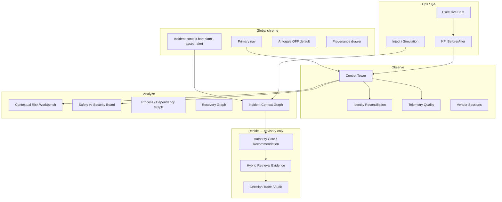
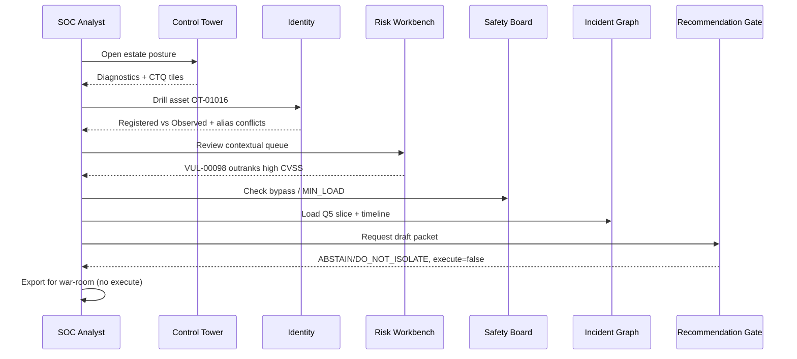
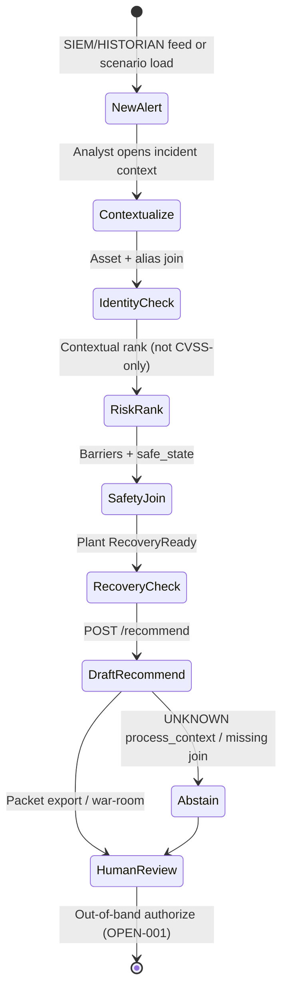
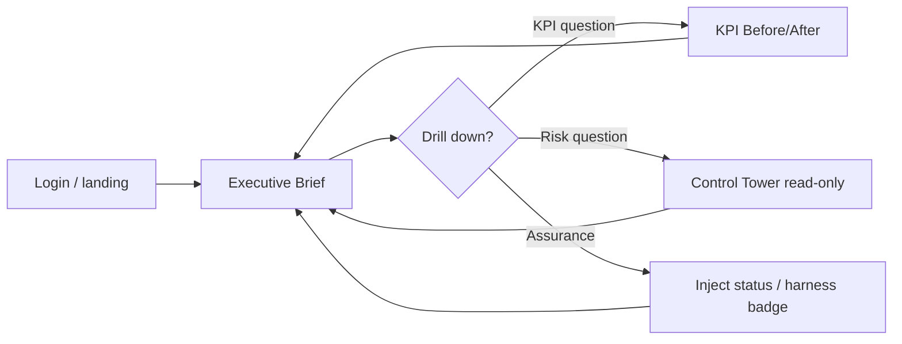

# APP_FLOW — Command Center operator flows

**APP-00** · Date: 2026-09-16  
**Personas:** Analyst (SOC) · Process Engineer · Safety Owner · Executive  
**Principle:** Evidence-first workbench — tables, graphs, and governed packets. Optional explainer is a side panel, never the primary surface.

---

## 1. Navigation map

### Primary nav (left rail)

| Group | Screen | Default persona |
|-------|--------|-----------------|
| **Home** | Control Tower | All |
| **Identity & data** | Identity Reconciliation, Telemetry Quality | Analyst |
| **Risk & safety** | Contextual Risk, Safety Board, Vendor Sessions | Analyst, Safety |
| **Process & recovery** | Process Graph, Recovery Graph | PE, Safety |
| **Incident** | Incident Context Graph, Recommendation Gate | Analyst, PE, Safety |
| **Evidence** | Hybrid Retrieval panel (drawer), Decision Trace | Analyst, FDE |
| **Quality** | Inject / Simulation, KPI, Executive Brief | FDE, Executive |

Context bar persists across incident screens: `plant_id`, `asset_id`, `alert_id`, scenario badge (nominal / inject / cascade).

---

## 2. User journeys

### 2.1 Analyst (SOC) — nominal alert triage

**Steps:** Control Tower → Identity → Risk → Safety → Incident Graph → Recommendation → Export trace.

### 2.2 Analyst — CASCADE-001 (EVAL-007)

1. Select scenario **CASCADE-001** from Inject rail (or context bar preset).
2. Control Tower highlights PLT-10; alert ALT-002783 pinned.
3. Incident Graph shows timeline: 08:24 vendor · 08:38 bypass · 08:47 SOC · 08:50 PE.
4. Recommendation Gate shows **dual column**: SOC isolate request vs PE destabilize warning (untrusted handover cited).
5. Authorize controls **disabled** until CTQ-ISO complete; execute never enabled.

### 2.3 Process Engineer — dissent on isolation

1. Notification/link from SOC packet (export or shared incident ID).
2. Open **Process / Dependency Graph** for PLT-10-U06 → downstream U07 safety dep.
3. Review **safe_state MIN_LOAD** on unit card.
4. Add consultation note (future override log — not Authorize in software, OPEN-001).
5. Return to Recommendation Gate — dissent visible beside SOC draft.

### 2.4 Safety Owner — bypass and trip boundaries

1. Open **Safety vs Security Conflict Board** filtered to plant.
2. Confirm BYPASSED + bypass_authorized=NO rows (e.g. PLT-10-SAFE-07).
3. Verify no trip suppression or SIS modify actions in tier catalog.
4. Review Recommendation Gate: `authorizable=false` if safe_state missing.
5. Consult on tier-3 human actions only — out of band.

### 2.5 Executive — posture brief

1. Open **Executive Brief** (read-only aggregate).
2. Scan CTQ tiles: SLO-OT, harness 31/31, legacy xfail contrast (3).
3. KPI before/after vs `docs/05` baseline — numeric targets OPEN-006.
4. Residual OPEN-RISK table — no execute controls on any screen.

---

## 3. Alert workflow

Alerts are **inputs**, not automatic isolation triggers.

| Stage | Screen | Exit criteria |
|-------|--------|---------------|
| Intake | Control Tower | Alert pinned in context bar |
| Enrich | Identity, Telemetry | Provenance visible; confidence shown |
| Rank | Risk Workbench | Factor breakdown, not CVSS sort |
| Safety | Safety Board | Bypass visible; no auto-isolate |
| Decide | Recommendation Gate | execute=false; roles listed |
| Close | Decision Trace | Trace appended |

**Forbidden:** Auto-transition to “Isolate” on HIGH/CRITICAL severity alone.

---

## 4. Incident workflow (8 engine states → UI stages)

Maps to `agent.run_incident_workflow` display states:

| Engine state | UI stage | Primary widgets |
|--------------|----------|-----------------|
| Request Validation | Incident header | Envelope fields, injection flag |
| Identity Resolution | Identity panel | Bundle + conflicts |
| Risk Correlation | Risk strip | Top-N contextual findings |
| Safety Evaluation | Safety panel | Conflicts + simulation view |
| Recovery Evaluation | Recovery strip | Plant blockers |
| Authority Evaluation | Tier legend | ACTION_TIERS catalog |
| Recommendation Generation | Packet builder | CTQ-ISO fields, evidence[] |
| Human Review | Gate footer | AwaitAuthorization, export only |

Progress indicator is **linear read-only** — not a chat thread. Timing_ms per stage shown in Decision Trace.

---

## 5. Executive workflow

Executives do not reach Recommendation Gate execute paths. Brief summarizes:
- Estate diagnostics (14 counters)
- Eval harness status
- SLO synthesis (`/ops/slo`)
- OPEN decisions count (not closed in UI)

---

## 6. AI-disabled vs AI-assisted mode

| Mode | Primary content | Explainer |
|------|-----------------|-----------|
| **AI off (default)** | Engine tables, graphs, deterministic rank | Hidden or “unavailable” |
| **AI on** | Same tables + optional narrative panel | Side panel; never replaces tables |

Toggle in global chrome. AI on does **not** enable execute or change ACTION_TIERS.

---

## 7. Empty / error / abstain states

| State | UX |
|-------|-----|
| Missing asset | 404 identity — show “not in any source” |
| unit_join_missing | Yellow banner; ABSTAIN recommendation |
| UNKNOWN process_context | Explicit label; no coerce to NORMAL |
| AI timeout | Banner + full manual fallback tables |
| Unauthorized (future OPEN-029) | Gate screen — not in workshop |
| Stale data | freshness: workshop-static on all provenance |

---

## 8. Forbidden interactions (all flows)

- No primary **Execute Isolation** button
- No **Write PLC** / **Modify SIS** / **Bypass interlock** actions
- No “Merge CMDB” or “Promote shadow to master”
- No chat-first landing — Control Tower is home

See `specs/APP_ACCEPTANCE_TESTS.md` APP-AT-020…022.
