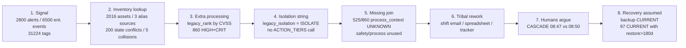
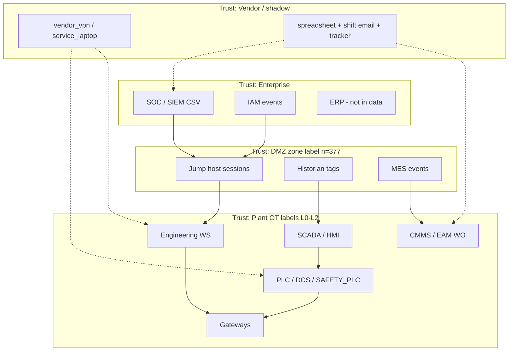
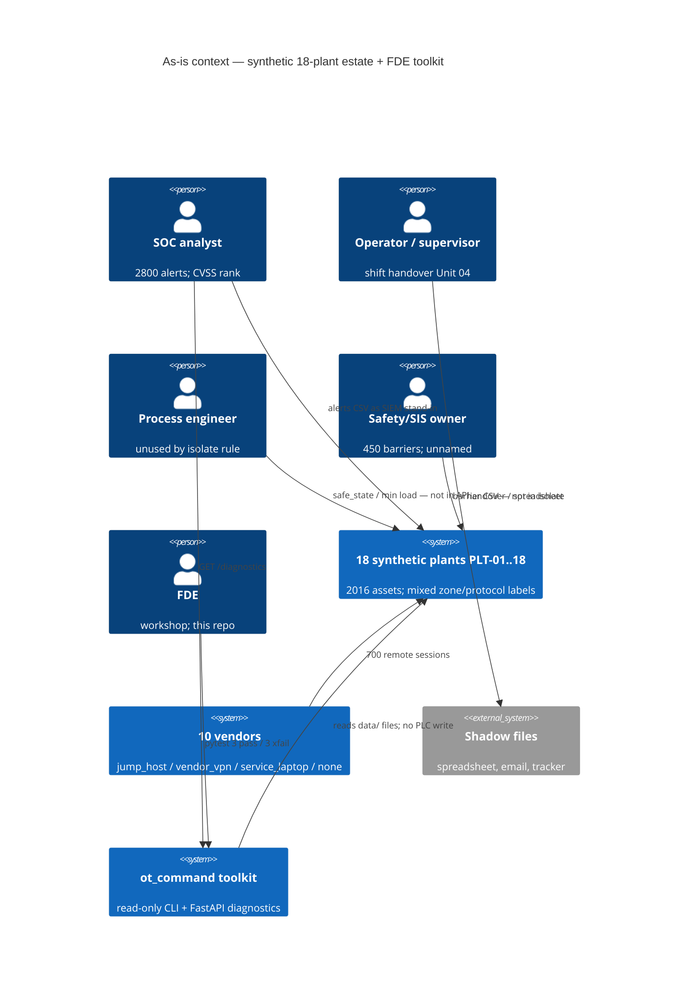
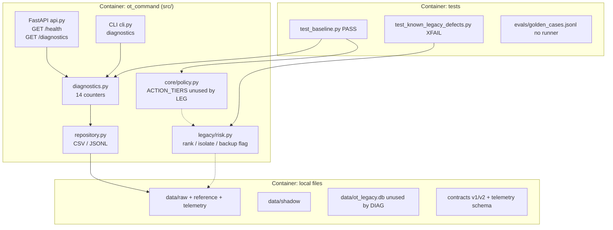

# SDD-02 — Current-state process and architecture baseline

**Prompt:** SDD-02 | OM-2 Discover process and architecture  
**Depends on:** `participant/work/sdd_15/SDD-01_mandate/CHARTER.md` (present)  
**Date:** 2026-09-15  
**FDE capabilities evidenced here (OM 2 homes):** C04, C06, C14 (Define/Measure only), C18, C25, C27, C29  
**Not this prompt:** 96 forensic cells (SDD-03); DMAIC Analyse (SDD-04); target KG / RAG / agents.

---

## Evidence used / assumptions / unknowns / what this artifact did not conclude

### Evidence used (file, field, count, id)

| Source | Grain used |
|---|---|
| `participant/work/sdd_15/SDD-01_mandate/CHARTER.md` | Mandate: advisory only; operational-truth permission UNKNOWN |
| `docs/03_current_state_architecture.md` | Documented Purdue-like stack + parallel undocumented paths (sketch, not a census) |
| `docs/07_v2_audit_and_changelog.md` | Intentional contradictions vs packaging; `__version__` claim vs `0.1.0` |
| `VERIFICATION.md` + `src/ot_command/diagnostics.py` | 14 Measure keys (200, 5, 779, 120, 4094, 47, 61, 73, 244, 137, 128, 25, 29, 35) |
| `data/raw/enterprise_events.jsonl` n=6500 | `source`, `event_type`, `event_time`, `received_time`, `correlation_id`, `payload_state` |
| `data/raw/cyber_alerts.csv` n=2800 | `severity`, `soc_status`, `process_context`, `type`; e.g. `ALT-000008`, `ALT-000040` |
| `data/raw/work_orders.csv` n=1250 | `cmms_status` vs `field_status`; e.g. `WO-000009`, `WO-000018` |
| `data/raw/remote_access_sessions.csv` n=700 | `method`, `identity`, `approved_window`, `mfa` |
| `data/raw/assets.csv` n=2016 | `asset_type`, `zone`, `protocol` |
| `data/raw/network_edges.csv` n=3780 | `documented`, `observed_last_24h`, `approved_path` |
| `data/raw/process_units.csv` n=216 | `safe_state` MIN_LOAD=54; `manual_mode_supported=NO` 19 |
| `data/raw/safety_barriers.csv` n=450 | e.g. `PLT-02-SAFE-17` BYPASSED + OVERDUE + bypass_authorized UNKNOWN |
| `data/raw/recovery_readiness.csv` n=144 | `PLT-01/IDENTITY` backup CURRENT, restore 360 days, runbook STALE |
| `data/raw/vulnerabilities.csv` n=1100 | OPEN HIGH/CRIT 409; cvss>=9 and reachable NO 53 |
| `data/raw/asset_aliases.csv` n=6048 | 5 colliding aliases |
| `data/shadow/shift_handover_email.txt` | Unit 04; isolate warning; spreadsheet vs CMDB claim |
| `data/shadow/ot_asset_inventory_FINAL_v8.csv` n=220 | 0 firmware/state diffs vs `assets.csv` for those IDs |
| `data/shadow/risk_acceptance_tracker.csv` n=180 | 134 expiry before 2026-09-15; 19 ACCEPT with owner Unknown |
| `data/reference/vendors.csv` n=10 | jump_host / vendor_vpn / service_laptop / none |
| `src/ot_command/**`, `contracts/*`, `tests/*` | Brownfield of **this repo** |
| `scenarios/cascade_001.json` | 08:47 SOC isolate vs 08:50 process-engineer warning |

`restricted_answer_key/` was not opened. No product code was changed.

### Assumptions

1. SDD-01 mandate still binds: workshop forensics allowed; operational truth UNKNOWN.
2. `run_diagnostics()` / `VERIFICATION.md` numbers are the DMAIC **Measure** snapshot.
3. Process mining describes **as-is file flows**, not a live SOC shift. Empty `correlation_id` is evidence, not dirt.
4. `docs/03` landscape is a sketch to be **tested** against file labels (`zone`, `method`, `source`), not accepted by name.

### Unknowns

1. A durable case ID linking alert → WO → session → barrier → recovery (`correlation_id` empty on **3251 / 6500** events).
2. Semantic meaning of `enterprise_events.event_type` when HISTORIAN emits `SESSION` / `WORK_ORDER`.
3. Why `ot_asset_inventory_FINAL_v8.csv` matches `assets.csv` firmware/state for all 220 overlapping IDs while the handover email claims the spreadsheet is newer.
4. Named humans who sit in the value-stream queues (OPEN-001).
5. Clock source for `event_time` vs `received_time` (407 events received **before** event_time; max lag 900s).

### What this artifact did not conclude

- Did not draw a future knowledge graph, RAG, digital twin, or agent topology.
- Did not pick a system of record among SIEM, CMMS, historian, SCADA, shadow files.
- Did not rank operational risk by CVSS.
- Did not treat `backup_status=CURRENT` as recovery-ready (PLT-01 IDENTITY is the counter-example).
- Did not authorize isolation. CASCADE-001 08:47 remains a **recommendation in a scenario**, not a permitted action.
- Did not silently align CMMS and field status.

**Gate self-check:** current-state claims below are file-backed. No to-be C4.

---

## Measure snapshot (quantify before narrating)

### A. Seeded diagnostics (`VERIFICATION.md` = `run_diagnostics()`)

| Key | n |
|---|---|
| asset_state_conflicts | 200 |
| alias_collisions | 5 |
| undocumented_network_paths | 779 |
| duplicate_telemetry_packets | 120 |
| telemetry_bad_or_uncertain | 4094 |
| telemetry_unit_mismatches | 47 |
| safety_bypassed_or_degraded | 61 |
| safety_proof_test_due | 73 |
| maintenance_state_conflicts | 244 |
| unapproved_remote_sessions | 137 |
| remote_sessions_without_confirmed_mfa | 128 |
| recovery_stale_or_unknown_backup | 25 |
| recovery_unverified_dependencies | 29 |
| recovery_stale_or_missing_runbooks | 35 |

Pytest: **3 passed, 3 xfailed**. API: `/health` + `/diagnostics` only.

### B. Process-mined queues (not in `run_diagnostics()`)

| Queue / defect | n | Source |
|---|---|---|
| SOC alert OPEN | 693 / 2800 | `cyber_alerts.soc_status` |
| SOC SUPPRESSED (incl. 211 HIGH/CRIT) | 683 (211) | same |
| HIGH+CRITICAL (legacy would emit ISOLATE) | **860** | `severity` + `legacy_isolation_recommendation` |
| HIGH+CRIT with `process_context=UNKNOWN` | **525 / 860** | `cyber_alerts` |
| CMMS queue OPEN+IN_PROGRESS+DEFERRED | **922 / 1250** | `work_orders.cmms_status` |
| CLOSED and field not RETURNED_TO_SERVICE | 244 | e.g. `WO-000009` PLT-10 OT-00991 CLOSED / OUT_OF_SERVICE |
| CLOSED missing `closed_at` | 133 | `work_orders` |
| Not CLOSED but `closed_at` populated | 489 | clock/status split |
| Temporary bypass YES | 94 (32 also CLOSED) | `temporary_bypass`; `WO-000018` CLOSED+ACTIVE+bypass YES+awaiting vendor |
| Enterprise events with empty `correlation_id` | **3251 / 6500 = 50.0%** | `enterprise_events.jsonl` |
| Received_time before event_time | **407 / 6500** | e.g. `EVT-0000001` SIEM CONFIG_CHANGE, received 17:47:35 vs event 17:48:00 |
| Median ingest lag (received − event) | **423 s** (min −60, max 900) | same |
| Risk-tracker expiry before 2026-09-15 | **134 / 180** | `risk_acceptance_tracker.expiry` |
| CURRENT backup AND restore test >180 days | **97 / 119** CURRENT rows | `recovery_readiness`; `PLT-01 IDENTITY` 360 days, runbook STALE |
| Vendor/service-laptop methods | jump_host 182, remote_desktop 179, local_service_laptop 170, vendor_vpn 169 | `remote_access_sessions.method` |

---

## 1. SIPOC — OT cyber-physical signal → governed response (as-is)

As-is the “governed” step is **not governed**. Isolation is a string. Policy exists and is unused.

| | As-is |
|---|---|
| **Suppliers** | SIEM-like `cyber_alerts.csv` (2800); 9 enterprise `source` values in `enterprise_events.jsonl` (IAM 749, MES 747, HISTORIAN 741, EAM 724, SCADA 717, PASSIVE_DISCOVERY 712, CMMS 704, VENDOR_PORTAL 704, SIEM 702); historian-style `tag_telemetry.jsonl` (31224); CMMS `work_orders.csv`; vendor/IAM-like `remote_access_sessions.csv`; shadow email + spreadsheet + tracker |
| **Inputs** | Alert (`alert_id`, `severity`, `type`, `process_context`); finding (`cvss`); asset row (`registered_state`/`observed_state`); barrier `state`; recovery flags; tribal notes |
| **Process** | Alert → inventory lookup (three alias sources + shadow) → `legacy_rank` by CVSS → `legacy_isolation_recommendation` on HIGH/CRITICAL → optional human argument (CASCADE-001 08:50) → optional tracker DEFER/ACCEPT → no API for a governed package |
| **Outputs** | `GET /diagnostics` 14 integers; `ISOLATE` or `MONITOR` string; `legacy_recovery_ready` boolean; pytest XFAIL documenting that those outputs are wrong for operations/safety/recovery |
| **Customers** | SOC (alert queue); process engineering (unused by isolate rule); safety owner (61 barriers not ACTIVE not in isolate function); operators (Unit 04 handover); FDE workshop (this repo) |

### SIPOC — maintenance work order → field restore (as-is)

| | As-is |
|---|---|
| **Suppliers** | CMMS-like `work_orders.csv`; EAM/CMMS/VENDOR_PORTAL events; vendors.csv SLA labels |
| **Inputs** | `work_order_id`, `cmms_status`, `field_status`, `temporary_bypass`, `notes` |
| **Process** | Open/progress/defer/close **on paper** without a join to field restore, safety bypass, or vendor ticket (handover: “formal ticket not yet updated”) |
| **Outputs** | 328 CLOSED; only **84** CLOSED ∩ RETURNED_TO_SERVICE; 244 CLOSED with field still ACTIVE/DEGRADED/OUT_OF_SERVICE |
| **Customers** | Maintenance planners, operators, safety (94 bypass YES) |

---

## 2. As-is value stream (SOC alert → inventory → OT eng → ops → safety → recovery)

Times below are **queue contents**, not measured cycle time. Mean time to contextualize is BASELINE_PENDING (OPEN-006). CASCADE-001 is a **scenario clock**, not a mined case.

| Step | What happens today | Queue / rework evidence | Five-state split |
|---|---|---|---|
| 1. SOC alert | `cyber_alerts` 01 Sep–05 Oct 2026; types include UNEXPECTED_WRITE 404, NEW_DEVICE 399 | OPEN 693; SUPPRESSED 683; TRIAGED 724; CLOSED 700 | Registered SOC status ≠ operational `process_context` (UNKNOWN 1735/2800) |
| 2. Inventory lookup | `assets.csv` + aliases CMDB/PASSIVE/CMMS 2016 each + shadow 220 IDs | 200 ACTIVE vs OFFLINE/UNSEEN; collisions e.g. `PLT-01-DCS_CONTROLLER-105`; owner Unknown 343 | Registered vs observed stay in one row — not reconciled |
| 3. Rank | `legacy_rank` sorts `cvss` desc; `legacy_risk_score` only multiplies by criticality label | 173 vulns cvss>=9; **53** of those `network_reachable=NO`; 35 OPEN + cvss>=9 + reachable NO | Cyber score ≠ process risk |
| 4. Containment draft | HIGH/CRIT → `ISOLATE`; e.g. `ALT-000008` CRITICAL NEW_DEVICE process_context UNKNOWN TRIAGED; `ALT-000040` CRITICAL UNEXPECTED_WRITE UNKNOWN **SUPPRESSED** | 860 would ISOLATE; 211 of HIGH/CRIT already SUPPRESSED | Decision authority unused |
| 5. OT engineering | CASCADE-001 08:07 “37 controllers, 6 unknown firmware” (scenario, not counted in this prompt); process_units `safe_state` MIN_LOAD **54**, ISOLATED 43, manual_mode NO **19** | No code path reads `process_units.csv` | Operational interpretation missing from isolate |
| 6. Operations | Handover Unit 04: vendor done, ticket not updated; HMI moved while historian pressure flat ~20 min | WO notes: awaiting vendor 224, operator workaround 252; 64 awaiting-vendor rows are **CLOSED** | Operational vs registered |
| 7. Safety | Barriers 61 not ACTIVE; 73 proof not CURRENT; `PLT-02-SAFE-17` INTERLOCK BYPASSED + OVERDUE + bypass_authorized UNKNOWN; `PLT-03-SAFE-14` PERMISSIVE BYPASSED + bypass_authorized **NO** | Isolate function does not read `safety_barriers.csv` | Safety state missing |
| 8. Recovery | `legacy_recovery_ready("CURRENT")` is True; `PLT-01 NETWORK` CURRENT but restore 185 days; `PLT-01 IDENTITY` CURRENT, restore 360, runbook STALE | 97 CURRENT ∩ restore>180; 28 CURRENT ∩ runbook not CURRENT; 23 CURRENT ∩ dep not YES | Resilience flags ≠ executable recovery |
| Tribal overlays | Spreadsheet, shift email, tracker | Tracker 71 ACCEPT / 51 DEFER / 58 MITIGATE; 41 owner Unknown; 134 expired before 15 Sep 2026 | Authority fragment |

Handoffs (enterprise integration friction): WORK_ORDER events are **not** mostly from CMMS (CMMS 118 / 901). SESSION events come from MES 124 and HISTORIAN 122. ALARM events from IAM 109. Sources are **not** authoritative by name.

---

## 3. Process mining (C06) — cases, lags, rework

### 3.1 There is no reliable case

- Unique `correlation_id` values: 1771 including empty string.
- Empty `correlation_id`: **3251 / 6500**.
- Max reuse on a non-empty ID: 6 (`COR-02369` and peers). Empty string reused 3251 times is not a case key.
- Assets appearing in events: 1937 / 2016; median 3 events/asset, max 10 — sequences exist, **joins to alerts/WOs are not keyed**.

This is a process-mining finding, not a license to invent a graph.

### 3.2 Time: waiting and clock defect

| Metric | Value |
|---|---|
| received − event_time median | 423 s |
| p90 | 800 s |
| max | 900 s |
| negative (received before event) | 407 |
| Example | `EVT-0000001` asset `OT-00850` plant `PLT-08` source SIEM type CONFIG_CHANGE payload_state DEGRADED |

WO closed duration where both timestamps exist: n=684, median **37 h**, max 72 h, none negative. Separately: 133 CLOSED with empty `closed_at` and 489 non-CLOSED with a `closed_at` — status and clock disagree.

Remote sessions: duration median 96.5 min (5–180).

Alert stream span: 2026-09-01 00:30:00 to 2026-10-05 23:43:00. No field for “time to contextualize.”

### 3.3 Rework / out-of-order maintenance

CMMS × field matrix (1250 cells, all combinations populated):

| cmms_status | ACTIVE | DEGRADED | OUT_OF_SERVICE | RETURNED_TO_SERVICE |
|---|---|---|---|---|
| CLOSED | 92 | 84 | 68 | 84 |
| DEFERRED | 74 | 68 | 64 | 81 |
| IN_PROGRESS | 71 | 83 | 81 | 97 |
| OPEN | 77 | 78 | 84 | 64 |

Rework signatures: IN_PROGRESS ∩ RETURNED_TO_SERVICE **97**; OPEN ∩ RETURNED_TO_SERVICE **64**; CLOSED ∩ not RTS **244**.

Temporary bypass YES and field DEGRADED or OUT_OF_SERVICE: **55**.

### 3.4 Alert × work-order overlap (not a proven causal join)

- Alert assets 1531; WO assets 934; overlap **703**.
- HIGH/CRIT assets 687; overlap WO **320**.
- Alerts labeled MAINTENANCE_WINDOW 357; only **163** of those assets have any WO row.

`process_context=MAINTENANCE_WINDOW` is **not** the same as a work order. Do not collapse.

### 3.5 Risk tracker as a parallel process

180 shadow decisions; 63 tracker assets also appear in HIGH/CRIT alerts. 19 ACCEPT with `risk_owner=Unknown`. Rationales are four canned phrases only (shutdown unavailable 48, vendor patch pending 44, business critical 44, compensating controls assumed 44). This is extra processing / authority theatre, not a measured control.

---

## 4. Waste register (Lean) — ≥8, each tied to repo evidence

| # | Waste | Evidence | Consequence class |
|---|---|---|---|
| W1 | Waiting on identity | 200 state conflicts; 5 alias collisions (`PLT-01-DCS_CONTROLLER-105`, `PLT-01-ENG_WORKSTATION-244`, `PLT-13-PLC-850`, `PLT-14-GATEWAY-737`, `PLT-15-VFD-444`); 343 owner Unknown; 1735/2800 alerts process_context UNKNOWN | Authority + cyber (wrong asset) |
| W2 | Extra processing (CVSS-only rank) | `legacy_rank` key=`cvss`; 53 findings cvss>=9 and reachable NO; XFAIL `test_contextual_risk_should_outrank_highest_cvss` | Cyber ≠ process risk |
| W3 | Defects (state conflicts) | 244 CMMS/field; 4094 bad/uncertain telemetry; 120 duplicates; 47 TEMP unit≠C; 407 negative event lags | Process + cyber |
| W4 | Unused expertise | `legacy_isolation_recommendation` ignores process/safety; CASCADE-001 08:50; handover “Do not isolate… min stable load”; 54 MIN_LOAD units unread by code | Safety + process |
| W5 | Handoffs / tribal knowledge | 9 enterprise sources; WORK_ORDER only 118/901 from CMMS; shift email; spreadsheet; tracker 134 expired | Authority |
| W6 | Overproduction of “response” | 860 HIGH+CRIT would ISOLATE; 211 of those already SUPPRESSED; 683 SUPPRESSED total | Cyber noise; process trip risk |
| W7 | Motion / undocumented transport | 779 undocumented ∩ observed-24h edges; 170 local_service_laptop sessions; 169 vendor_vpn; vendors.csv `service_laptop` MotorDriveCo/SensorTech; 137 unapproved sessions | Cyber + resilience |
| W8 | Defective recovery processing | `legacy_recovery_ready` trusts CURRENT; 97 CURRENT with restore>180 days; XFAIL restore-test test | Resilience |
| W9 | Waiting on vendor | WO notes awaiting vendor 224; 64 of those CLOSED; RemoteAssist/SafeLogic SLA 4h is a **label**, not measured | Process |
| W10 | Duplicate contracts / unused policy | asset API v1 vs v2 unimplemented; `ACTION_TIERS` unused by isolate; `__version__` 0.1.0 vs 2.0.0 | Authority + cyber (integration) |
| W11 | Inventory mismatch between shadow artifacts | Email says spreadsheet newer than CMDB; `ot_asset_inventory_FINAL_v8.csv` vs `assets.csv`: **0** firmware diffs and **0** state-pair diffs on 220 IDs | Unknown-unknown until SDD-03; do not pick a winner |

---

## 5. System landscape and data flows (C25)

Documented sketch (`docs/03`) vs **file labels** (not live Purdue certification):

| Landscape node (`docs/03`) | What exists in files | Trust note |
|---|---|---|
| Enterprise IT / SOC / IAM / ERP | SIEM 702 events; IAM 749; `cyber_alerts` 2800; no ERP table | SOC CSV is not “the SIEM” |
| DMZ | `assets.zone=DMZ` **377 / 2016** | Zone is a column, not a firewall |
| Historian | 150 HISTORIAN assets; 741 HISTORIAN events; 31224 tag records `source=HISTORIAN` on TEL-00000000 | 4094 quality not GOOD |
| Jump host | `method=jump_host` 182 sessions; vendors ControlWorks/FieldLink/… `remote_access=jump_host` | Session ≠ approved path |
| MES bridge | MES 747 events (top SESSION 124) | MES emitting SESSION is a semantic defect |
| SCADA | 717 SCADA events; HMI 149 assets | Not a live SCADA |
| Engineering | ENG_WORKSTATION 164 | CASCADE vendor session on engineering workstation (scenario) |
| CMMS/EAM | 1250 WOs; CMMS 704 + EAM 724 events | 244 paper-closed |
| PLC/DCS | PLC 153, DCS_CONTROLLER 176, SAFETY_PLC 162 | 14 SAFETY_PLC ACTIVE vs OFFLINE/UNSEEN |
| Gateways / field | GATEWAY 167; L0_FIELD 420; sensors 151; IED 151; RTU 142; VFD 130 | Mixed protocols 10 kinds |
| Vendor VPN / service laptops | vendor_vpn 169; local_service_laptop 170; vendors ProcessSys/HistorianX vendor_vpn | Parallel to documented stack |
| Shadow spreadsheet / shift notes | 220-row CSV; 1 email; 180-row tracker | Outside plant zone; no authn |

Dashed arrows are **undocumented / shadow** paths. 779 edges are documented=NO and observed_last_24h=YES. 168 edges approved_path=NO and observed YES.

Protocols on assets (not a live capture): PROFIBUS 223, IEC104 215, IEC61850 210, OPC_DA 206, PROFINET 204, DNP3 201, ModbusTCP 199, EtherNetIP 195, VendorSerial 182, OPC_UA 181.

---

## 6. Brownfield assessment of **this repo** (C04, C27)

Authentic brownfield contradiction vs accidental packaging — classified from `docs/07` interpretation rule + files.

| Item | Evidence | Class |
|---|---|---|
| `legacy_risk_score` / `legacy_rank` | `src/ot_command/legacy/risk.py` L2–L7; criticality multiplier unused by `legacy_rank` (sorts cvss only) | **Authentic decision-policy defect** (XFAIL) |
| `legacy_recovery_ready` | L9–10 backup_status == CURRENT | **Authentic** (XFAIL) |
| `legacy_isolation_recommendation` | L12–13 HIGH/CRITICAL → ISOLATE | **Authentic** (XFAIL); safety-blind |
| `diagnostics.py` heuristics | UNKNOWN lumped with NO (approved_window, mfa, backup, runbook, dep, quality, proof_test) | **Authentic heuristic**; Measure is conservative, not a permission model |
| API surface | `api.py` GET `/health`, GET `/diagnostics` only; mode synthetic-read-only | **Authentic** limited product |
| ACTION_TIERS unused | `policy.py` not imported by `risk.py` or isolate path; tests only check PLC/SIS vs summarize | **Authentic authority gap** |
| XFAIL tests | `tests/test_known_legacy_defects.py` strict xfail | **Authentic**; do not delete |
| Shadow files | handover vs tracker vs spreadsheet | **Authentic** tribal process |
| Asset API v1 vs v2 | `/assets/{id}` assetId/fwVersion/operationalState vs `/ot-assets/{asset_id}` asset_id/firmware/observed_state; neither implemented | **Authentic contract drift** |
| Telemetry schema missing ingest_time/source/asset_id | schema vs TEL-00000000 which has all three | **Authentic contract incompleteness** |
| `__version__` 0.1.0 vs pyproject/API/manifest 2.0.0 | `__init__.py` vs `docs/07` “normalized to 2.0.0” | **Packaging contradiction**; OPEN-010; do not silently fix here |
| `data/ot_legacy.db` unused by diagnostics | 6 tables match CSV counts | Lineage OPEN-007 |
| `generate_data.py --check-only` | Does not generate; checks manifest paths | Packaging/tooling |
| Dockerfile listens 0.0.0.0 | Local synthetic; no OT connector | Allowed workshop surface; still no writes |
| Restricted answer key removed | `docs/07`; `verify_repo.py` banned-term scan | Release hygiene, not domain cleanup |

`run_diagnostics()` **does not read** vulnerabilities, process_units, process_dependencies, cyber_alerts, enterprise_events, plants, tags, shadow, SQLite, or `last_restore_test_days`. The command center’s only live metric API is blind to the value stream in §2.

---

## 7. Current-state C4 (C29)

Component boxes exist **only where source files exist**. No future containers.

### 7.1 Context

If C4Context rendering is unavailable, equivalent structure: people (SOC, ops, PE, SIS, FDE) around systems (18 plants, 10 vendors, shadow files, ot_command). Only relation that executes in software is **read files / print diagnostics**.

### 7.2 Container

Dashed: `legacy/risk.py` is **not** wired to the API. `policy.py` is **not** wired to isolate. SQLite is **not** wired to diagnostics.

### 7.3 Component (source files only)

| Component file | Role as-is |
|---|---|
| `repository.py` | I/O |
| `diagnostics.py` | Measure heuristics |
| `legacy/risk.py` | Defective decision policy |
| `core/policy.py` | Tier map; default unknown action = 4 |
| `api.py` | Two GET routes |
| `cli.py` | One command |
| `contracts/asset_api_v1.yaml` / `v2.yaml` | Unimplemented, conflicting |
| `contracts/telemetry_event_schema.json` | Incomplete vs records |

No other application components exist.

---

## 8. DMAIC Define / Measure (C14) — Analyse is SDD-04

**Define (problem statement, not RCA):** The as-is process turns OT cyber-physical signals into **ungoverned strings** (ISOLATE / CURRENT / high CVSS first) while five states disagree. Customers of a “command center” cannot complete a governed response without tribal rework.

**Measure — what is measured today**

| Measured | Where | Missing relative to value stream |
|---|---|---|
| 14 diagnostic integers | `run_diagnostics()`, `/diagnostics` | No rates, no time, no uncertainty object |
| Alias collisions > 0 etc. | `test_baseline.py` | Exact counts not asserted |
| PLC/SIS require approval | `requires_human_approval` | Isolation recommend not gated |
| Seeded recovery dep gaps > 0 | baseline test | Restore-test days unused |

**Measure — present in files but unused by the product**

| Field / file | Why it matters to the value stream |
|---|---|
| `last_restore_test_days` | 114/144 >180 days; 97 of CURRENT backups |
| `cyber_alerts.process_context` | 1735 UNKNOWN |
| `process_units.safe_state` | MIN_LOAD 54 unread |
| `safety_barriers.*` | Isolate does not read |
| `vulnerabilities.network_reachable` | Rank does not read |
| `enterprise_events` lag / empty correlation | No case mining in product |
| `work_orders.field_status` | Diagnostics counts 244; API does not expose rows |
| Shadow tracker expiry | 134 expired; unused |

**Not measured at all (OPEN-006):** MTT contextualize, approval latency, AI cost, false-positive escalation, degraded-operation duration, evidence-completeness score.

Define/Measure stops here. No Improve/Control. No architecture option.

---

## 9. Dependencies, data flows, trust boundaries (C18)

### 9.1 Data flows (as-is)

1. Files on disk → `repository.rows/jsonl` → `run_diagnostics` → CLI stdout or GET `/diagnostics`.
2. Tests import `legacy_rank` / `legacy_recovery_ready` / `legacy_isolation_recommendation` **in-process**; no plant I/O.
3. Humans (not code) would have to open CSV + shadow email to walk §2. That is the current architecture.

### 9.2 Trust boundaries

| Boundary | Inside | Crossing evidence | Constraint |
|---|---|---|---|
| TB-1 Plant OT (L0–L2 labels) | PLC/DCS/safety_plc/sensors | 779 undocumented observed edges; VendorSerial 182 | Do not treat `zone` as enforced segmentation |
| TB-2 DMZ | 377 assets zone=DMZ; jump_host | Jump sessions 182 | Session row is not a permit |
| TB-3 Enterprise SOC/IAM | alerts, SIEM/IAM events | 2800 alerts; 137 unapproved remote | SIEM name ≠ truth |
| TB-4 Vendor remote | vendor_vpn, service_laptop, identity vendor.engineer 123 (20 unapproved) | Parallel to jump_host | OPEN-003 for production use |
| TB-5 Shadow / unofficial | spreadsheet, email, tracker | Handover vs CSV mismatch (W11) | Not a system of record; do not drop |
| TB-6 FDE toolkit | src/ + tests | Read-only API; no OT write path | Keep write surface at zero |
| TB-7 Safety function | safety_barriers, SAFETY_PLC | 14 SAFETY_PLC identity conflicts; isolate ignores barriers | Isolation execute forbidden |

### 9.3 Constraint / assumption register

| ID | Type | Statement | Evidence | If violated |
|---|---|---|---|---|
| CSTR-01 | Constraint | No PLC/SIS/interlock/setpoint/auto-isolate execute in this repo | `api.py`; `docs/06`; mandate | Engagement fail |
| CSTR-02 | Constraint | Do not clean contradictory records | `docs/07`; AGENTS.md | Loss of brownfield evidence |
| CSTR-03 | Constraint | UNKNOWN permission is not permission | SDD-01 CHARTER §7 | False authority |
| CSTR-04 | Constraint | Highest CVSS is not highest operational risk | 53 cvss>=9 reachable NO; XFAIL rank | Wrong queue |
| ASM-01 | Assumption | Workshop synthetic data may be mined | README; manifest notes | N/A in this repo |
| ASM-02 | Assumption | VERIFICATION.md counts remain the Measure baseline until re-run | Phase 0 | SDD-04 must re-cite if changed |
| ASM-03 | Assumption | `docs/03` boxes map to labels, not live networks | zone/method columns | Architecture overclaim |
| DEP-01 | Dependency | Process engineer + safety owner must be in isolation **draft** path | CASCADE-001; handover; OPEN-008 | Unsafe isolate draft |
| DEP-02 | Dependency | Recovery judgement depends on restore-test + runbook + deps, not backup flag | `PLT-01 IDENTITY`; XFAIL | False resilience |
| DEP-03 | Dependency | Identity lookup depends on aliases + shadow + observed/registered remaining distinct | 200 conflicts; 5 collisions | Wrong asset acted on |
| DEP-04 | Hidden | Empty correlation_id on 3251 events | enterprise_events | Cannot mine end-to-end cases without inventing keys |
| OPEN | — | Named approvers, legal class, production data use, ACTION_TIERS verb gaps | OPEN-001…011 | See OPEN_DECISIONS.md |

---

## 10. OM-2 capability evidence (96 FDE stack — this phase only)

| ID | Capability | Where evidenced | Status |
|---|---|---|---|
| C04 | Current-state / brownfield assessment | §6 + §7 C4 | specced |
| C06 | Process discovery and process mining | §2–§3 (events, alerts, WOs, lags, rework) | specced |
| C14 | DMAIC Define/Measure | §8 (Analyse deferred) | specced for D/M |
| C18 | Constraint, assumption, dependency | §9.3 | specced |
| C25 | Enterprise integration | §5 landscape + 9-source event table | specced |
| C27 | Brownfield modernization (as-is only) | §6 authentic vs packaging | specced as-is |
| C29 | Architecture | §7 current-state C4 only | specced |

---

## 11. Gate (SDD-02)

| Criterion | Result |
|---|---|
| Current-state evidence-backed (file/field/count/id) | **PASS** |
| Process mining beyond SIPOC | **PASS** — §3 |
| DMAIC Define/Measure without Analyse/Improve | **PASS** |
| No future KG / target architecture | **PASS** |
| Five states not collapsed | **PASS** |
| No controller/SIS/unsafe isolation recommended | **PASS** |

**Output to next:** as-is process + architecture baseline. SDD-03 may fill L1–L12 × 8 cells using these queues and IDs. SDD-03 must not treat this C4 as a to-be design.
