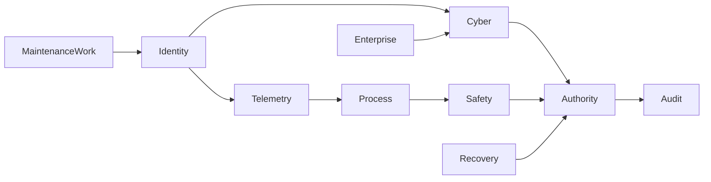

# SDD-06 — Domain model (OM-5)

**Prompt:** SDD-06 | OM-5 Domain model  
**Depends on:** SDD-01 CHARTER, SDD-04 SCQA, SDD-05 USE_CASE (present)  
**Date:** 2026-09-16  
**FDE capabilities evidenced:** C15, C21, C22 (glossary/BC seed; ontology engineering is OM 9), C82  
**Not this prompt:** information architecture / KG (SDD-09/10); code modernization.

**Ban (ubiquitous language):** a single field named `status`; `recovery_ready` := `backup_status == CURRENT`; `critical` := isolate; `quality == GOOD` := process healthy; `recommend` := `AUTHORIZE` / execute.

---

## Evidence used / assumptions / unknowns / what this artifact did not conclude

### Evidence used (file / field / count)

| Source | Terms / invariants taken from it |
|---|---|
| `data/raw/assets.csv` n=2016 | `asset_id`, `asset_type`, `registered_state` (ACTIVE 1776, UNKNOWN 122, RETIRED 118), `observed_state` (ONLINE 1656, INTERMITTENT 129, UNSEEN 128, OFFLINE 103) |
| `data/raw/asset_aliases.csv` n=6048 | `asset_id`, `source` ∈ {CMDB, PASSIVE, CMMS}, `alias`; 5 collisions |
| `data/reference/tags.csv` n=864 | `tag_id`, `unit_id`, `asset_id`, `engineering_unit`; 182 distinct assets |
| `data/telemetry/tag_telemetry.jsonl` n=31224 | `quality` GOOD/UNCERTAIN/BAD; `event_time`, `ingest_time` |
| `data/raw/cyber_alerts.csv` n=2800 | `severity`, `soc_status`, `process_context` |
| `data/raw/vulnerabilities.csv` n=1100 | `cvss`, `severity`, `network_reachable`, `compensating_control` |
| `data/raw/safety_barriers.csv` n=450 | `state`, `proof_test_status`, `bypass_authorized`, `barrier_type` |
| `data/raw/work_orders.csv` n=1250 | `cmms_status`, `field_status` |
| `data/raw/remote_access_sessions.csv` n=700 | `approved_window`, `mfa`, `identity` |
| `data/raw/recovery_readiness.csv` n=144 | `backup_status`, `last_restore_test_days`, `runbook_status`, `dependency_verified`, `manual_fallback` |
| `data/raw/process_units.csv` n=216 | `safe_state`, `production_criticality`, `manual_mode_supported` |
| `src/ot_command/core/policy.py` | `ACTION_TIERS`, `requires_human_approval` |
| `src/ot_command/legacy/risk.py` | **anti-model** (must not encode as domain truth) |
| `docs/06_security_safety_assurance.md` | allowed / reversible / human / forbidden; recommendation packet |
| `contracts/asset_api_v1.yaml`, `v2.yaml` | field-name split (OPEN-009) |
| SDD-05 use case | Isolation **decision** = human; recovery **orchestration** = human |

### Assumptions

1. Bounded contexts below are **language and ownership** boundaries, not a chosen datastore or KG.
2. Role owners are SDD-01 titles; people remain OPEN-001.
3. Enumerations listed are **observed in files**, not certified plant standards.

### Unknowns

OPEN-004 verbs (`enrich`, `rank evidence`, `capture evidence`, `maintenance-mode`) absent from `ACTION_TIERS`. OPEN-009 v1 `operationalState` vs v2 `observed_state`. OPEN-025 `device` has no column. OPEN-026 process “healthy” has no field.

### What this artifact did not conclude

- Did not pick a system of record.
- Did not implement types in code.
- Did not map `ISOLATED` (unit `safe_state`) to SOC `ISOLATE`.
- Did not authorize any ACTION_TIERS ≥ 3 execute.

**Gate self-check:** every overloaded term in §1 is defined or has an OPEN owner. No term enters later architecture undefined.

---

## 1. Ubiquitous language (C15, C21, C22)

Qualified names **win**. Do not say “the status.”

### 1.1 Asset vs alias vs tag vs device

| Term | Definition | Evidence | Not |
|---|---|---|---|
| **Asset** | Identified OT/IT-OT object with `asset_id` (e.g. OT-01016). Grain of `assets.csv`. | 2016 rows; `asset_type` is a **class label** (PLC, SAFETY_PLC, …) | Not an alias string; not a tag |
| **Alias** | A name from a **named source** pointing at an `asset_id`. | `asset_aliases.csv`: source+alias; `PLT-01-DCS_CONTROLLER-105` → OT-00012 **and** OT-00033 | Not a unique key (EVAL-001) |
| **Tag** | Historian/process point: `tag_id` bound to `asset_id` + `unit_id`. | `tags.csv` 864; only **182** assets have tags (OPEN-020) | Not the asset; not quality |
| **Device** | **No column** in this repo. Informal speech for a physical box. | — | Must not appear in APIs. Use Asset + `asset_type`. **OPEN-025** |

### 1.2 Five states (must not collapse)

| Term | Definition | Field / artifact | Observed values (not exhaustive of plant reality) |
|---|---|---|---|
| **RegisteredState** | What an inventory stored as the asset’s enrolment state | `assets.registered_state` | ACTIVE, UNKNOWN, RETIRED |
| **ObservedState** | What observation/scan last claimed | `assets.observed_state` | ONLINE, INTERMITTENT, UNSEEN, OFFLINE |
| **OperationalInterpretation** | What operations/SOC process context claims | `cyber_alerts.process_context`; shift email | NORMAL, MAINTENANCE_WINDOW, DEGRADED, UNKNOWN |
| **SafetyBarrierState** | Recorded protection state for a barrier on a unit | `safety_barriers.state` | ACTIVE, DEGRADED, BYPASSED |
| **DecisionAuthority** | Who may act at which ActionTier | `policy.py`; RACI; `risk_owner` | Role titles; **no named person** (OPEN-001) |

**RecoveryReady** is **not** a fifth copy of those states. It is a **derived judgement** in the Recovery context (§1.5).

Related, do not mix:

| Term | Field | Meaning |
|---|---|---|
| **ProcessContext** | `cyber_alerts.process_context` | SOC’s operational interpretation of the alert, **not** `observed_state` |
| **SafeState** | `process_units.safe_state` | Intended process safe operating mode: STOPPED, RECIRCULATE, MIN_LOAD, **ISOLATED** |
| **ProofTestStatus** | `safety_barriers.proof_test_status` | CURRENT, DUE, OVERDUE — not barrier `state` |
| **BypassAuthorized** | `safety_barriers.bypass_authorized` | YES, NO, UNKNOWN — UNKNOWN ≠ permission |

**Collision to ban:** `safe_state = ISOLATED` (process mode) ≠ isolation **recommendation** `ISOLATE` ≠ isolate **execute**.

### 1.3 cvss vs contextual_operational_risk

| Term | Definition | Evidence |
|---|---|---|
| **Cvss** | Numeric scanner score on a finding | `vulnerabilities.cvss`; 173 ≥ 9; **53** of those `network_reachable=NO` |
| **FindingSeverityLabel** | Scanner **label**, often **not** the CVSS band | 830/1100 mismatch; VUL-00008 CRITICAL / cvss 4.1 |
| **AssetCriticality** | Inventory criticality of the asset | `assets.criticality` |
| **UnitProductionCriticality** | Process unit production criticality | `process_units.production_criticality` HIGH 109, CRITICAL 86, MEDIUM 21 |
| **SocSeverity** | Alert severity on `cyber_alerts.severity` | CRITICAL 199, HIGH 661, … |
| **ContextualOperationalRisk** | Ordered operational concern using **at least** reachability, process criticality, safety barrier state, compensating control, recovery judgement (EVAL-002). **Not** cvss-only. | `legacy_rank` is the **anti-definition** |

**Ban:** `critical` without a qualifier. **Ban:** `critical` := isolate.

### 1.4 approved_window vs mfa vs identity (sessions)

| Term | Definition | Field | Count reminder |
|---|---|---|---|
| **SessionIdentity** | Label of who/what opened the session | `remote_access_sessions.identity` | unknown 140; vendor.engineer 123; … |
| **ApprovedWindow** | Whether the session claims an approved time window | `approved_window` | YES 563, UNKNOWN 76, NO 61 → diagnostics unapproved **137** |
| **Mfa** | Whether MFA is recorded as YES | `mfa` | YES 572, UNKNOWN 72, NO 56 → **128** not YES |
| **AssetIdentity** | Reconciliation of Asset + Alias set (Identity context) | aliases + registered/observed | Different context from SessionIdentity |

UNKNOWN on window or MFA is **not** approval (SDD-01).

### 1.5 backup_status CURRENT vs recovery_ready

| Term | Definition | Field |
|---|---|---|
| **BackupStatus** | Backup-flag label | `backup_status` CURRENT 119, STALE 16, UNKNOWN 9 |
| **RestoreTestFreshness** | Days since last restore test | `last_restore_test_days` p50 **376** |
| **RunbookStatus** | Runbook currency | CURRENT 109, STALE 14, MISSING 21 |
| **DependencyVerified** | Recovery dependency check | YES 115, NO 16, UNKNOWN 13 |
| **ManualFallback** | Manual fallback capability | YES 55, LIMITED 47, NO 42 |
| **RecoveryReady** | **Derived:** restore-test freshness acceptable **and** runbook CURRENT **and** dependency_verified = YES (CTQ-REC; EVAL-005). Optional: manual fallback considered as evidence, not a substitute. | **Not** `legacy_recovery_ready` |

**113 / 119** CURRENT backups fail this derived predicate (SDD-03). `legacy_recovery_ready` is **invalid** in this language.

**CURRENT** itself is overloaded (backup vs proof_test vs runbook) — always say **BackupCurrent**, **ProofTestCurrent**, **RunbookCurrent**.

### 1.6 soc_severity vs isolation_recommendation

| Term | Definition |
|---|---|
| **SocSeverity** | `cyber_alerts.severity` |
| **SocStatus** | `soc_status` OPEN/TRIAGED/CLOSED/SUPPRESSED — **not** SIS trip suppression (OPEN-017) |
| **IsolationRecommendation** | Advisory string or structured draft: MONITOR, DO_NOT_ISOLATE, ISOLATE_DRAFT (needs safe_state + required role — CTQ-ISO) |
| **IsolationExecution** | Performing `isolate_endpoint` (ACTION_TIERS 3). **Not in this use case as software.** |
| **LegacyIsolationRecommendation** | `legacy_isolation_recommendation`: HIGH/CRITICAL → `"ISOLATE"` — **anti-model** |

### 1.7 cmms_status vs field_status

| Term | Field | Values (counts) |
|---|---|---|
| **CmmsStatus** | `work_orders.cmms_status` | IN_PROGRESS 332, CLOSED 328, OPEN 303, DEFERRED 287 |
| **FieldStatus** | `work_orders.field_status` | RETURNED_TO_SERVICE 326, ACTIVE 314, DEGRADED 313, OUT_OF_SERVICE 297 |

**244** CLOSED ∧ field ≠ RETURNED_TO_SERVICE. Closed paper ≠ restored field (WO-000009).

### 1.8 quality GOOD vs process healthy

| Term | Definition |
|---|---|
| **TelemetryQuality** | `tag_telemetry.quality` ∈ {GOOD, UNCERTAIN, BAD}; 27130 / 2743 / 1351 |
| **ProcessHealthy** | **No field.** Must not be inferred from GOOD tags, ACTIVE registered_state, or ACTIVE barriers alone. **OPEN-026** |
| **UnitSafeState** | See SafeState — a **mode**, not a health certificate |

GOOD quality means the **record’s quality flag**, not that the boiler is in a safe envelope.

### 1.9 policy recommend vs human AUTHORIZE

| Term | ACTION_TIERS | Who | Software today |
|---|---|---|---|
| **Observe / Correlate / Summarize** | 0 | May be autonomous (`docs/06`) | diagnostics is observe-like |
| **Recommend** | 1 | System may emit a **draft packet** (`docs/06` fields required) | `legacy_isolation_recommendation` emits ISOLATE **without** packet |
| **ReversibleChange** | 2 | Policy-controlled in a **real** implementation: `request_fresh_telemetry`, `open_ticket`, `increase_logging`; `capture evidence` named in docs/06 **not** in dict (OPEN-004) | **Not implemented** |
| **Authorize** | Human speech-act **before** execute of tier ≥3 | Named human (OPEN-001) | **No Authorizer entity in data** |
| **ExecuteConsequential** | 3 | Human after Authorize: isolate_endpoint, change_remote_access, change_firewall; docs/06 also maintenance-mode (OPEN-004) | **Forbidden as code** in this repo |
| **ForbiddenControl** | 4 | Never: write_plc_logic, change_setpoint, modify_sis, bypass_interlock; plus trip suppression / unsafe restart (`docs/06`) | `requires_human_approval` true; still **must not implement** |

`requires_human_approval(action)` is true when `ACTION_TIERS.get(action, 4) >= 3`. Unknown action **defaults to 4** — fail closed, not a license to implement.

**Recommend ≠ Authorize ≠ Execute.**

### 1.10 Additional terms (implementable)

| Term | Definition |
|---|---|
| **Plant** | `plant_id` PLT-01…18 |
| **ProcessUnit** | `unit_id` e.g. PLT-10-U06 |
| **ProcessDependency** | `upstream_unit` → `downstream_unit` + `dependency_type` + documented/critical flags |
| **Barrier** | `barrier_id` on a unit |
| **Reachability** | `vulnerabilities.network_reachable` YES/NO/UNKNOWN |
| **CompensatingControl** | `compensating_control` label (ALLOWLIST, MONITORED, SEGMENTED, NONE, UNKNOWN) — not proven |
| **Evidence** | Cited file/field/id/count in a recommendation packet |
| **Freshness** | event_time vs ingest/received; restore-test days; backup_age_days (proxy only) |
| **Uncertainty** | Explicit UNKNOWN / UNCERTAIN / missing join — not a fake 0.9 |
| **RecommendationPacket** | evidence, source, freshness, uncertainty, process impact, safety impact, rollback, required authority (`docs/06`) |
| **ShadowEvidence** | spreadsheet, shift email, tracker — evidence, not dirt (BR-05) |
| **NetworkEdge** | `network_edges` documented / observed_last_24h / approved_path |

---

## 2. Bounded contexts (prompt set)

Eight contexts required by this prompt. Maintenance and Enterprise are **adjacent** (feeds) so they do not leak “status” into Identity.

| Context | Core language | Data grain (as-is files) | Anticorruption |
|---|---|---|---|
| **Identity** | Asset, Alias, RegisteredState, ObservedState, AssetCriticality | assets, aliases, shadow inventory | v1 `operationalState` / v2 `observed_state` / CSV `registered_state` **must not merge** (OPEN-009) |
| **Telemetry** | Tag, TelemetryQuality, event_time, ingest_time, unit | tags, tag_telemetry | Schema omits ingest_time/source/asset_id — treat records as richer than contract |
| **Process** | ProcessUnit, SafeState, ProcessDependency, UnitProductionCriticality | process_units, process_dependencies, tags.unit_id | `process_context` on alerts lives in Cyber, not here |
| **Cyber** | Finding, Cvss, SocSeverity, Reachability, Session* | vulns, alerts, remote sessions, edges | Do not import IsolationExecution |
| **Safety** | Barrier, SafetyBarrierState, ProofTest, BypassAuthorized | safety_barriers | Do not execute bypass_interlock |
| **Recovery** | BackupStatus, RestoreTestFreshness, RunbookStatus, DependencyVerified, RecoveryReady | recovery_readiness | Ban CURRENT ⇒ Ready |
| **Authority** | ActionTier, Recommend, Authorize, Execute, ForbiddenControl | policy.py, RACI, tracker.risk_owner | Unknown action = tier 4 **as default deny implement** |
| **Audit** | RecommendationPacket, Evidence, Freshness, Uncertainty, HumanAuthorizationRecorded | **missing as-is** (evals stubs only) | Must not use `/diagnostics` ints as an audit log |

Adjacent (not extra architecture): **MaintenanceWork** (cmms vs field), **EnterpriseAccess** (9 event sources, vendors). They publish events; they do not own IsolationExecution.

Upstream/downstream: Identity and Telemetry **upstream** of Process joins. Safety and Recovery **constrain** Authority. Audit is **downstream** of every Recommend. Cyber must not write Safety.

Shared kernel: `asset_id`, `plant_id`, `unit_id` as **identifiers only** — not a shared `status`.

---

## 3. Domain capability map

Aligned to challenge brief / SDD-05 card (capabilities, not technologies):

| Capability | Contexts | As-is | Target-language (not a build) |
|---|---|---|---|
| Identity reconciliation | Identity, Audit | 3 alias sources; 5 collisions; 200 state conflicts | Show conflict set + confidence (EVAL-001) |
| Telemetry quality | Telemetry, Audit | 4094 bad/uncertain; 47 F-on-TEMP | Dual clock + quality (EVAL-004) |
| Process/consequence join | Process, Identity | 182/2016 tagged | Asset → unit → downstream (traces A–C) |
| Contextual operational risk | Cyber, Process, Safety, Recovery | CVSS sort | EVAL-002 order |
| Safety/security conflict | Safety, Process, Authority | Isolate ignores barriers | CTQ-ISO drafts |
| Resilience judgement | Recovery | CURRENT flag | RecoveryReady predicate |
| Bounded recommendation | Authority, Audit | ACTION_TIERS unused | Packet + HITL |
| TEVV | Audit | 6 stubs, 3 XFAIL | SDD-08 |
| Non-AI war room fallback | Authority | CASCADE narrative | SDD-05 §4 |

---

## 4. Business rules / invariants

From `docs/06`, `policy.py`, SDD-04 CTQs, SDD-03 forensics.

| ID | Rule | Source |
|---|---|---|
| BR-01 | Five truths (Registered, Observed, OperationalInterpretation, SafetyBarrierState, DecisionAuthority) **must not collapse** into one `status`. | SDD-01; AGENTS.md |
| BR-02 | ContextualOperationalRisk **must outrank** Cvss when reachability, process criticality, safety, controls, or recovery say so. | EVAL-002; XFAIL rank |
| BR-03 | Isolation is **never** an autonomous execution. IsolationRecommendation ≠ IsolationExecution. | docs/06; SDD-05; EVAL-003 |
| BR-04 | RecoveryReady requires RestoreTestFreshness **and** RunbookCurrent **and** DependencyVerified. BackupCurrent is insufficient. | EVAL-005; CTQ-REC |
| BR-05 | Shadow sources are **evidence, not dirt**. Do not silently clean. | AGENTS.md; OPEN-015 |
| BR-06 | UNKNOWN / UNCERTAIN is not permission, not YES, not GOOD. | SDD-01; diagnostics treats UNKNOWN as fail — **visibility**, not a coerce-to-NO license in language |
| BR-07 | Recommend must expose evidence, freshness, uncertainty, process impact, safety impact, rollback, required authority. | docs/06 |
| BR-08 | ACTION_TIERS 0 may run autonomously (observe/correlate/summarize). Tier 1 recommend is a **draft**. Tier 2 reversible is design-only here. Tier ≥3 requires human Authorize before any Execute. Tier 4 is **ForbiddenControl** even with a human in software. | policy.py; docs/06; SDD-05 |
| BR-09 | `requires_human_approval` true must not be implemented as an execute path in this repo. | api.py read-only; CTQ-0 |
| BR-10 | Isolation **draft** must include Unit SafeState and required role (100% workshop CTQ-ISO) or it is invalid. | SDD-04 |
| BR-11 | Alias is not Asset. CMDB is not truth by name. | EVAL-001 |
| BR-12 | TelemetryQuality GOOD ≠ ProcessHealthy. | §1.8; OPEN-026 |
| BR-13 | SocSeverity HIGH/CRITICAL does not imply IsolationRecommendation ISOLATE. | legacy anti-model; 32 unsafe joins |
| BR-14 | CmmsStatus CLOSED does not imply FieldStatus RETURNED_TO_SERVICE. | 244 rows |
| BR-15 | SessionIdentity unknown / ApprovedWindow UNKNOWN / Mfa UNKNOWN ≠ approved access. | 137 / 128 |
| BR-16 | SafeState ISOLATED is not IsolationExecution. | process_units 43 ISOLATED |
| BR-17 | FindingSeverityLabel may disagree with Cvss; neither is ContextualOperationalRisk. | 830 mismatches |
| BR-18 | Trip suppression and unsafe restart are forbidden; SOC SUPPRESSED is not SIS suppression. | docs/06; OPEN-017 |
| BR-19 | Identity conflicts remain **visible** (CTQ-ID). Hiding aliases is a failed counter-metric. | SDD-04 |
| BR-20 | Default unknown action → tier 4 means **do not invent a tool**, not “implement as PLC write.” | policy.py `.get(action,4)` |

Invariants for any later type: `RecoveryReady` cannot be a stored column equal to `backup_status`; `IsolationExecution` cannot exist as an API route.

---

## 5. Decision model (Observe / Recommend / Authorize / Execute)

Roles from SDD-01 (unnamed people). **Execute of tier ≥3 is out of software** even after Authorize.

| Action | Tier | Observe | Recommend (draft) | Authorize | Execute in this repo |
|---|---|---|---|---|---|
| observe, correlate, summarize | 0 | FDE tooling, SOC | n/a | n/a | Allowed (read files) |
| recommend | 1 | — | SOC / FDE system | n/a | Draft packet only |
| request_fresh_telemetry, open_ticket, increase_logging | 2 | — | SOC | Policy (unnamed) | **Not implemented**; not OT write |
| isolate_endpoint | 3 | SOC, PE, Safety | SOC **draft** after BR-10 | VP Ops + Safety + PE | **No** |
| change_remote_access, change_firewall | 3 | Vendor Access, SOC | draft | OT-CISO / Vendor Access | **No** |
| maintenance-mode (docs/06) | 3 working | Ops | draft | VP Ops | **No**; key missing OPEN-004 |
| write_plc_logic, change_setpoint, modify_sis, bypass_interlock | 4 | may **observe** recorded bypass | **must refuse** | **must refuse** | **No** |

War-room fallback (SDD-05): same table with system Recommend replaced by checklist.

---

## 6. Domain events

Events are **facts to detect/record**, not jobs to actuate.

| Event | Meaning | Evidence seed |
|---|---|---|
| `AssetIdentityConflictDetected` | Registered vs observed or alias collision | 200; 5 collisions; OT-00528 RETIRED∩ONLINE |
| `TelemetryQualityDegraded` | quality ≠ GOOD, unit mismatch, or ingest lag | 4094; 47 F; p50 120s |
| `SafetyBarrierBypassed` | state BYPASSED or DEGRADED | 61; PLT-03-SAFE-14 |
| `UnapprovedRemoteSessionObserved` | approved_window ≠ YES or mfa ≠ YES | 137; 128 |
| `RecoveryAssumptionFalsified` | BackupCurrent but not RecoveryReady | 113/119; PLT-01 IDENTITY |
| `IsolationRequestedBySoc` | SOC isolate intent | CASCADE 08:47; 860 legacy strings |
| `IsolationBlockedByProcessSafety` | MIN_LOAD / bypass / PE warning | CASCADE 08:50; 32 joins; handover |
| `HumanAuthorizationRecorded` | Named Authorize for tier ≥3 | **No instances in repo** (OPEN-001) |
| `MaintenancePaperClosedFieldNotRestored` | Cmms CLOSED ∧ field ≠ RTS | 244; WO-000009 |
| `ProcessContextUnknownOnHighAlert` | HIGH/CRIT ∧ process_context UNKNOWN | 525/860 |

Publishing an event does **not** grant Execute.

---

## 7. Ownership map (C82)

| Context | Accountable (role) | Responsible (workshop) | Consulted |
|---|---|---|---|
| Identity | OT-CISO (inventory policy) | FDE (visibility) | Maint/CMMS, Ops |
| Telemetry | VP Ops / Process Eng | FDE | SOC |
| Process | Site Process Engineering | Process Eng | Safety, Ops |
| Cyber | SOC manager | SOC | OT-CISO, Vendor Access |
| Safety | Safety/SIS owner | Safety | Process Eng |
| Recovery | VP Ops | Ops / continuity | OT-CISO |
| Authority | OT-CISO | FDE (policy encoding) | all |
| Audit | OT-CISO / FDE (evals) | FDE | Safety |
| MaintenanceWork (adjacent) | Maint/CMMS | Planners | Ops |
| Enterprise (adjacent) | OT-CISO | SOC / IAM labels | Vendors (limited) |

People names: **OPEN-001**. Tracker `risk_owner=Unknown` (41) is not an owner.

---

## 8. Terms that shall not enter architecture without this glossary or an OPEN owner

| Overloaded speech | Required replacement | If still ambiguous |
|---|---|---|
| status | qualified *State / *Status term above | — |
| device | Asset + asset_type | OPEN-025 |
| healthy | TelemetryQuality or SafeState or RecoveryReady — never implied | OPEN-026 |
| ready | RecoveryReady predicate | — |
| critical | Cvss / FindingSeverityLabel / AssetCriticality / UnitProductionCriticality / SocSeverity | — |
| isolate | IsolationRecommendation vs IsolationExecution vs SafeState ISOLATED | — |
| identity | AssetIdentity vs SessionIdentity | — |
| CURRENT | BackupCurrent / ProofTestCurrent / RunbookCurrent | — |
| authorize | human Authorize vs requires_human_approval() | OPEN-001 |
| capture evidence / enrich / rank / maintenance-mode | map to ACTION_TIERS or remain OPEN-004 | OPEN-004 |
| operationalState (v1) | not ObservedState without ACL | OPEN-009 |

---

## 9. OM-5 capability evidence

| ID | Where |
|---|---|
| C15 DDD | Contexts, events, rules, decision model |
| C21 Knowledge / ubiquitous language | §1 glossary |
| C22 Taxonomy seed | Qualified states; ontology engineering deferred OM 9 |
| C82 Operational ownership | §7 |

---

## Gate (SDD-06)

| Criterion | Result |
|---|---|
| Required disambiguations present | **PASS** §1.1–1.9 |
| ACTION_TIERS + docs/06 in rules and decision model | **PASS** BR-07–BR-09, §5 |
| Eight bounded contexts named | **PASS** §2 |
| No KG/RAG/agent as architecture | **PASS** |
| Overloaded leftovers owned | **PASS** OPEN-004, 009, 001, 025, 026 |

**Output to next:** implementable language for SDD-07 datasheets (keys must use these terms). Code must not invent a new `status` field.
