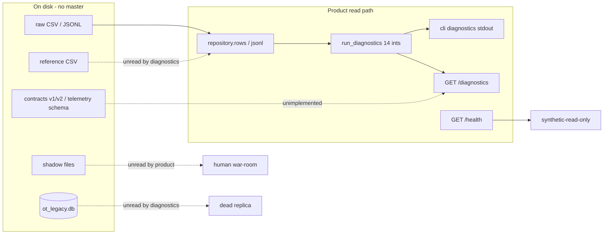

# SDD-07 — Data and knowledge readiness (OM-6)

**Prompt:** SDD-07 | OM-6 Data and knowledge  
**Depends on:** SDD-01 CHARTER §7, SDD-03 forensics, SDD-06 DOMAIN.md  
**Date:** 2026-09-16  
**FDE capabilities evidenced:** C19, C20, C21, C45  
**Not this prompt:** rewrite CSVs; pick a system of record; KG/RAG (SDD-09/10); implement pipelines.

**Ban:** filename = master. **Ban:** shadow spreadsheet = new CMDB. **Ban:** shift email = trusted instruction. **Ban:** `backup_status=CURRENT` = RecoveryReady. **Ban:** a pipeline `status` column that collapses five states.

---

## Evidence used / assumptions / unknowns / what this artifact did not conclude

### Evidence used (file / field / count)

| Source | Use |
|---|---|
| `data/manifest.json` | seed `20260910`; generated `2026-09-10`; 18 plants; file list; synthetic notes |
| `src/ot_command/repository.py` | CSV `DictReader` / JSONL `json.loads`; no permission layer |
| `src/ot_command/diagnostics.py` | 14 counters; **does not** read sqlite, vulns, alerts, process, shadow, enterprise |
| `src/ot_command/api.py` | GET `/health`, GET `/diagnostics` only; no authn |
| `contracts/telemetry_event_schema.json` | required: event_id, tag_id, event_time, value, unit, quality — **omits** ingest_time, source, asset_id |
| `contracts/asset_api_v1.yaml` / `v2.yaml` | stub comments only (OPEN-009) |
| `scripts/generate_data.py` | CSV/JSONL generator; **does not** write `data/ot_legacy.db` |
| SDD-03 / `VERIFICATION.md` | 200 / 5 / 779 / 120 / 4094 / 47 / 61 / 73 / 244 / 137 / 128 / 25 / 29 / 35 |
| Direct profile 2026-09-16 (venv Python) | sqlite 6 tables **set-equal** to matching CSVs; telemetry ingest lag p50 120s; enterprise received-before-event 407; shadow vs assets diffs 0 on firmware/observed/registered/ip/type |
| `LICENSE.txt` | synthetic training; no real OT |
| SDD-06 DOMAIN.md | keys and banned terms for datasheets |

### Assumptions

1. Workshop forensics of synthetic files is allowed (`README.md`, manifest `notes`). Operational-truth permission remains **UNKNOWN** (CHARTER §7).
2. Datasheet keys use SDD-06 terms. `vulnerabilities.status` is named **FindingDisposition** here — not SocStatus, not SafetyBarrierState.
3. Restore-test freshness threshold is **not** chosen (OPEN-006 / OPEN-022). Counts below cite days as facts, not a policy SLA.

### Unknowns

OPEN-003 production reuse. OPEN-007 sqlite **refresh process** (content currently identical; no ETL in repo). OPEN-009 contract vs records. OPEN-015 shadow vs CMDB winner. OPEN-020 why 1834 assets have no tag. OPEN-024 production PII/licensing. OPEN-027 no restore-test artifacts / backup blobs.

### What this artifact did not conclude

- Did not pick CMDB, PASSIVE, CMMS, sqlite, or shadow as master.
- Did not implement contracts or pipelines.
- Did not treat 18-plant seed as a real fleet prior.
- Did not grant production access.

**Gate self-check:** a data engineer can ingest with provenance without treating any filename as system of record.

---

## 1. Inventory (C19) — every dataset

Permissible use for **all** rows: **synthetic local workshop forensics only**. Operational-truth = UNKNOWN. Live OT = forbidden.

| ID | Path | Grain / n | Keys | Freshness field | Owner-context (SDD-06) | Claim type |
|---|---|---|---|---|---|---|
| D-MAN | `data/manifest.json` | 1 | seed | `generated` 2026-09-10 | Audit | reference |
| D-PLT | `data/reference/plants.csv` | 18 | `plant_id` | none | Identity / Process | reference |
| D-VEN | `data/reference/vendors.csv` | 10 | `vendor_id` | none (SLA is a **label**) | Enterprise adjacent | reference |
| D-TAG | `data/reference/tags.csv` | 864; 182 assets | `tag_id` | none (`historian_enabled` flag) | Telemetry / Process | reference |
| D-AST | `data/raw/assets.csv` | 2016 | `asset_id` | `backup_age_days` (age, **not** RecoveryReady) | Identity | registered + observed **same row** |
| D-ALS | `data/raw/asset_aliases.csv` | 6048 = 2016×3 | (`source`,`alias`) not unique | none | Identity | registered + passive |
| D-EDG | `data/raw/network_edges.csv` | 3780 | plant + source_asset + target_asset | `observed_last_24h` | Cyber | documented vs observed flags |
| D-UNT | `data/raw/process_units.csv` | 216 | `unit_id` | none | Process | registered process |
| D-DEP | `data/raw/process_dependencies.csv` | 198 | upstream→downstream | none | Process | registered / partial undocumented |
| D-TEL | `data/telemetry/tag_telemetry.jsonl` | 31224 | `event_id` | `event_time`, `ingest_time` | Telemetry | observed |
| D-VUL | `data/raw/vulnerabilities.csv` | 1100 | `finding_id` | none | Cyber | registered finding |
| D-ALT | `data/raw/cyber_alerts.csv` | 2800 | `alert_id` | `timestamp` | Cyber | SOC + ProcessContext |
| D-SAF | `data/raw/safety_barriers.csv` | 450 | `barrier_id` | `proof_test_status` (label, not a clock) | Safety | recorded barrier |
| D-WO | `data/raw/work_orders.csv` | 1250 | `work_order_id` | `opened_at`,`closed_at` | MaintenanceWork adjacent | CmmsStatus + FieldStatus |
| D-RA | `data/raw/remote_access_sessions.csv` | 700 | `session_id` | `start_time`,`end_time` | Cyber / Authority | observed session + flags |
| D-REC | `data/raw/recovery_readiness.csv` | 144 = 18×8 | (`plant_id`,`component`) | `last_restore_test_days` | Recovery | registered resilience flags |
| D-ENT | `data/raw/enterprise_events.jsonl` | 6500 | `event_id` | `event_time`,`received_time` | Enterprise adjacent | mixed |
| D-SQL | `data/ot_legacy.db` | 6 tables, counts match CSV | same as source CSVs | none | **unused replica** | registered replica |
| D-SHI | `data/shadow/ot_asset_inventory_FINAL_v8.csv` | 220 | `asset_id` ⊂ assets | `backup_age_days` | Identity (shadow) | shadow evidence |
| D-TRK | `data/shadow/risk_acceptance_tracker.csv` | 180 | plant+asset | `expiry` | Authority (shadow) | shadow authority |
| D-EML | `data/shadow/shift_handover_email.txt` | 1 note, Unit 04 | none | narrative clocks only | Process / Authority | **untrusted content** |
| D-SCN | `scenarios/cascade_001.json` + `inject_01`…`06` | eval injects | scenario id | timeline in JSON | Audit / eval | eval narrative |
| D-EVL | `evals/golden_cases.jsonl` | 6 stubs | `case_id` | none | Audit | eval spec |
| D-CTR | `contracts/*` | 3 stubs | — | — | Identity / Telemetry | contract **not implemented** |

**Datasheets (this prompt):** `datasheets/DS-*.md` for assets, aliases, telemetry, vulns, alerts, safety, work orders, remote access, recovery, shadow inventory, shift email, enterprise events.

---

## 2. Lineage (C20) — CSV → diagnostics → API



**Observed lineage facts**

| Hop | Evidence | Loss / collapse |
|---|---|---|
| File → `rows()` / `jsonl()` | `repository.py` opens `ROOT/rel` UTF-8 | No `extracted_at`; no ACL; no schema validate |
| Rows → 14 integers | `diagnostics.py` | See §2.1 |
| Integers → HTTP | `api.py` `return run_diagnostics()` | No row-level identity/risk API |
| Integers → CLI | `cli.py` `json.dumps` | Same payload |
| CSV → sqlite | 6 tables **set-equal** to CSVs (profile 2026-09-16) | **No writer in `scripts/generate_data.py`**. Diagnostics **never** open the DB. Not a second master. Refresh = OPEN-007 |
| Records → telemetry contract | Record has `ingest_time`,`source`,`asset_id` | Schema required-set omits them (OPEN-009) |
| Asset APIs | v1 `assetId`/`operationalState`; v2 `asset_id`/`observed_state` | FastAPI implements **neither** |

**Not in the product path:** vulns, alerts, process units/deps, tags (except telemetry `tag_id` string), enterprise events, shadow, sqlite, ACTION_TIERS, recommendation packets.

### 2.1 Diagnostic collapse (do not promote to facts)

| Counter | Predicate | What it hides |
|---|---|---|
| `asset_state_conflicts` = 200 | Registered ACTIVE ∧ Observed in {OFFLINE, UNSEEN} | Ignores RETIRED∩ONLINE (99, e.g. OT-00528); ignores INTERMITTENT |
| `alias_collisions` = 5 | alias string count > 1 | Same PASSIVE alias, two `asset_id`s — not CMDB-vs-field |
| `undocumented_network_paths` = 779 | documented=NO ∧ observed_last_24h=YES | `approved_path=UNKNOWN` 240 unread |
| `duplicate_telemetry_packets` = 120 | extra copies of (tag_id, event_time, value, unit) | Quality/source unused in key |
| `telemetry_bad_or_uncertain` = 4094 | quality ≠ GOOD | BAD 1351 vs UNCERTAIN 2743 lumped |
| `telemetry_unit_mismatches` = 47 | `*_TEMP` ∧ unit ≠ C | All F in SDD-03; other units not checked |
| `safety_bypassed_or_degraded` = 61 | SafetyBarrierState ≠ ACTIVE | BYPASSED 26 + DEGRADED 35 **one bucket** |
| `safety_proof_test_due` = 73 | ProofTestStatus ≠ CURRENT | DUE 29 + OVERDUE 44 lumped |
| `maintenance_state_conflicts` = 244 | CmmsStatus CLOSED ∧ FieldStatus ≠ RETURNED_TO_SERVICE | Other disagreements unread |
| `unapproved_remote_sessions` = 137 | ApprovedWindow ≠ YES | NO 61 + UNKNOWN 76 lumped as fail-visible |
| `remote_sessions_without_confirmed_mfa` = 128 | Mfa ≠ YES | NO 56 + UNKNOWN 72 lumped |
| `recovery_stale_or_unknown_backup` = 25 | BackupStatus ≠ CURRENT | Ignores `last_restore_test_days` (p50 **379**; 114/144 >180) |
| `recovery_unverified_dependencies` = 29 | DependencyVerified ≠ YES | NO 16 + UNKNOWN 13 lumped |
| `recovery_stale_or_missing_runbooks` = 35 | RunbookStatus ≠ CURRENT | STALE 14 + MISSING 21 lumped |

**Future** identity/risk APIs (not designed here) must emit **rows with provenance**, not only these ints.

---

## 3. Quality profile (C20) — intentional evidence vs accidental drift

### 3.1 Intentional brownfield evidence (do not clean)

| Dataset | Seeded defect (count / id) | Domain term |
|---|---|---|
| Assets | 200 ACTIVE vs OFFLINE/UNSEEN; 99 RETIRED∩ONLINE (OT-00528); owner Unknown 343 | RegisteredState ≠ ObservedState |
| Aliases | 5 colliding alias strings, all PASSIVE (e.g. `PLT-01-DCS_CONTROLLER-105` → OT-00012 and OT-00033) | Alias ≠ Asset |
| Telemetry | 4094 quality ≠ GOOD; 120 duplicate packets; 47 TEMP unit ≠ C; ingest−event p50 120s max 240s | TelemetryQuality; dual clock |
| Vulns | 830/1100 FindingSeverityLabel ≠ CVSS band; 53 cvss≥9 ∧ reachable NO; reachable UNKNOWN 344 | Cvss ≠ ContextualOperationalRisk |
| Alerts | process_context UNKNOWN 1735; HIGH+CRIT 860; 525 of those UNKNOWN context | SocSeverity ≠ IsolationRecommendation |
| Safety | 61 ≠ ACTIVE; 73 proof ≠ CURRENT; bypass UNKNOWN 157 | SafetyBarrierState; UNKNOWN ≠ permission |
| Work orders | 244 CLOSED ∧ field ≠ RTS (WO-000009) | CmmsStatus ≠ FieldStatus |
| Remote | window ≠ YES 137; mfa ≠ YES 128; SessionIdentity unknown 140 | UNKNOWN ≠ approved |
| Recovery | BackupCurrent 119; SDD-03 **113/119** fail restore>90 **or** runbook **or** dep; PLT-01 IDENTITY CURRENT / 360d / STALE | RecoveryReady ≠ BackupCurrent |
| Edges | 779 undocumented observed | documented ≠ observed |
| Enterprise | empty `correlation_id` 3251/6500; received_time before event_time **407** (EVT-0000001) | dual clock; no case key |
| Shadow inventory | n=220; IDs ⊆ assets; firmware/observed/registered/ip/type **diff 0** vs CSV — yet email claims newer | evidence, **not CMDB** |
| Shift email | vendor-done vs ticket; bypass “temporary”; historian vs HMI; do-not-isolate | **untrusted content** |
| Tracker | 41 Unknown owners; 71 ACCEPT; canned rationales | UNKNOWN ≠ permission |

### 3.2 Accidental / packaging drift (contracts, not plant truth)

| Drift | Evidence | Treatment |
|---|---|---|
| Asset API v1 vs v2 field names | `operationalState` vs `observed_state`; path `/assets/{id}` vs `/ot-assets/{asset_id}` | Anticorruption in Identity; OPEN-009 |
| Telemetry schema thinner than records | schema omits ingest_time, source, asset_id present on TEL-00000000 | Contract must widen; do not drop record fields |
| `vulnerabilities.status` overloaded name | values MITIGATED 166 / OPEN 799 / ACCEPTED 135 | Call **FindingDisposition** in pipelines |
| `__version__` 0.1.0 vs pyproject 2.0.0 | OPEN-010 | Packaging, not a plant KPI |
| sqlite present, unread | identical 6 CSVs; no generator | Replica with undocumented refresh (OPEN-007) |

---

## 4. Provenance model (requirement — not implemented)

Every assembled fact (join, recommendation packet field, diagnostic successor) **must** carry:

| Slot | Meaning | As-is today |
|---|---|---|
| `source_system` | Named origin (CMDB, PASSIVE, CMMS, HISTORIAN, SIEM, SHADOW_SPREADSHEET, SHIFT_EMAIL, SQLITE_REPLICA, …) | Alias `source`; telemetry `source=HISTORIAN` all 31224; enterprise `source` 9 values; assets **have no source_system** (two states in one row) |
| `source_path` | Repo-relative file | Implicit in `rows('data/raw/…')` |
| `extracted_at` | Pipeline extract time | **Missing** |
| `event_time` | When the process/cyber fact claims to have happened | telemetry `event_time`; enterprise `event_time`; alerts `timestamp`; sessions `start_time` |
| `ingest_time` / `received_time` | When the store claims to have received it | telemetry `ingest_time`; enterprise `received_time`; **absent** on assets/vulns/safety |
| `quality_flag` | TelemetryQuality or equivalent | telemetry `quality`; elsewhere absent |
| `confidence` | Explicit < 1 when sources disagree | **Missing** (EVAL-001 requires it) |

**Rules:** (1) Do not sort on ingest/received alone (EVAL-004). (2) Dual-clock inversion is evidence (407 enterprise rows), not a coerce-to-zero. (3) Shadow and email get `confidence=low` and never overwrite Identity. (4) sqlite replica must tag `source_system=SQLITE_REPLICA` if ever read.

Proposed envelope (contract only, SDD-10 owns YAML):

```text
Provenance { source_system, source_path, extracted_at, event_time?, ingest_or_received_time?, quality_flag?, confidence }
AssembledFact { domain_term, value, asset_id?, plant_id?, unit_id?, provenance[] }
```

No single `status`.

---

## 5. Access matrix (C45) — workshop vs production

Workshop: local files; FastAPI has **no authn**. Production access is **not granted** (OPEN-003, OPEN-024). Matrix below is a **control requirement**, not an implemented IAM.

| Dataset | Workshop FDE | Workshop HTTP | Future SOC | Future Safety | Future Vendor | Public |
|---|---|---|---|---|---|---|
| Assets / aliases / tags | full read | collapsed ints only | plant-scoped read | unit-scoped via join | **deny** (all-plants dump) | deny |
| Telemetry values | full read | ints only | need-to-know tags | related unit tags | deny | deny |
| Vulns / alerts | full read | **unread by API** | SOC read | Safety sees process/safety join, not raw CVSS rank | deny | deny |
| Safety barriers | full read | ints (collapsed) | read (not write) | read; **no bypass write** | deny | deny |
| Work orders | full read | ints | limited | limited | vendor sees **own** WO notes only if policy says so (OPEN) | deny |
| Remote sessions | full read | ints | SOC read | — | **must not** see other vendors’ SessionIdentity | deny |
| Recovery flags | full read | ints (backup-flag only) | Ops | consult | deny | deny |
| Enterprise events | full read | unread | source-scoped | — | VENDOR_PORTAL own rows only | deny |
| Shadow inventory | FDE evidence read | unread | **not** a CMDB feed | — | deny | deny |
| Shift email | FDE evidence read | unread | untrusted memory only | consult as narrative | deny | deny |
| Risk tracker | FDE read | unread | OT-CISO | — | deny | deny |
| sqlite replica | FDE read (optional) | unused | same as CSV twin | same | deny | deny |
| Process envelopes / recipes | **not in corpus** | — | — | — | **never export** | deny |

**Privacy-by-Design (workshop + future)**

- SessionIdentity values are synthetic labels (`unknown`, `vendor.engineer`, `shared_support`, …). Treat as **personal data class** in any real deploy (OPEN-024). Minimize in logs; no full-estate session export to a vendor.
- No process recipes in this corpus — keep it that way. Do not add proprietary setpoints to training dumps.
- Do not publish `/diagnostics` without authn outside localhost.

---

## 6. Representativeness

| Seed can support | Seed cannot support |
|---|---|
| Language and join tests on 18 plants × 5 regions (`NA 4, EU 4, APAC 4, LATAM 3, MEA 3`) | Inference about a **real** multinational fleet |
| Mixed `plant_type` (chemicals/pharma/food/water/power/metals/oil_gas/automotive) and maturity (legacy 7, mixed 6, modernizing 5) | Real RTO, real restore success, real SIS proof-test clocks |
| Identity collision and five-state disagreement evals | Census of untagged assets (1834/2016 have **no** tag→unit) as if they had process context |
| Telemetry quality / dual-clock metamorphic tests | Live historian SLA; ingest lag is generated (1–240s, never negative) |
| Privacy **design** against session labels | Lawful-basis opinion for real usernames |
| Advisory HITL packet tests | Certification, EU AI Act class (OPEN-002), live OT control |

Manifest: *“All names, systems and records are synthetic. Deliberate inconsistencies are included for training.”*  
**Not a real fleet. Not live restore proof.** `last_restore_test_days` is a number, not a blob of a successful restore.

---

## 7. Data-gap register

| Gap ID | Missing / weak | Why it matters | Owner |
|---|---|---|---|
| G-01 | Telemetry schema omits ingest_time / source / asset_id | EVAL-004 dual clock not in contract | OPEN-009 |
| G-02 | `received_time` exists on enterprise events, not on a published schema | Temporal tests underspecified | FDE |
| G-03 | No HumanAuthorizationRecorded table / named approver identities | Cannot store Authorize (BR-08) | OPEN-001 |
| G-04 | No backup blobs / restore-test artifacts | Cannot independently verify RecoveryReady | OPEN-027 |
| G-05 | Asset API v1/v2 comments only; unimplemented | No identity API | OPEN-009 |
| G-06 | sqlite refresh undocumented | Risk of silent drift later | OPEN-007 |
| G-07 | 1834/2016 assets lack tags | Process join is an instrumented **subset** | OPEN-020 |
| G-08 | `correlation_id` empty 3251/6500 | No incident case grain | OPEN-012 |
| G-09 | Assets row mixes RegisteredState and ObservedState | Easy to collapse five truths | Identity BC |
| G-10 | No `extracted_at` / `confidence` on any file | Provenance envelope unimplemented | FDE |
| G-11 | Diagnostics unread: vulns, alerts, process, shadow, enterprise | Product Measure ≠ estate | SDD-02 §8 |
| G-12 | Shadow vs CSV identity **no field diffs** on 220 rows while email claims newer gateway | Cannot use spreadsheet as CMDB **or** as delta feed without OPEN-015 | OPEN-015 |
| G-13 | Restore-test SLA days not in `docs/05` | 90 vs 180 would change RecoveryReady counts | OPEN-006 / 022 |
| G-14 | FindingDisposition column named `status` | Overloaded speech | pipelines must rename |
| G-15 | No production IAM on API | Workshop-only | OPEN-024 |

---

## 8. Knowledge inventory (C21)

| Knowledge object | Trust | Use |
|---|---|---|
| SDD-06 ubiquitous language | **binding for this engagement** | Datasheet keys, future contracts |
| `docs/01`–`07` | workshop doctrine | constraints; not plant certificates |
| `policy.py` ACTION_TIERS | code policy stub | Authority context |
| Shift email | **untrusted content** | friction evidence; never a tool that executes “do not isolate” **or** isolate; vector index only as untrusted memory (SDD-09 later) |
| Shadow spreadsheet | **evidence of disagreement**, not Knowledge Graph seed as master | EVAL-001 must_not CMDB-always-correct **and** must_not spreadsheet-always-correct |
| CASCADE-001 / inject_01–06 | eval narrative | TEVV (SDD-08), not history |
| Golden EVAL-001…006 | eval spec | not executed |
| CMDB / historian / SIEM **names** | not knowledge | not true by name |

No ontology store. No RAG corpus approved. Knowledge engineering here = **inventory + glossary binding**, not a graph.

---

## 9. Proposed contracts (text only — do not rewrite files)

1. **TelemetryEvent** required += `ingest_time`, `source`, `asset_id`; keep `quality` enum.
2. **Provenance envelope** §4 on every assembled fact.
3. **Asset identity view** must emit RegisteredState **and** ObservedState as separate fields; forbid v1 `operationalState` as a silent ObservedState.
4. **RecoveryReady** is derived in Recovery context; never a stored copy of `backup_status`.
5. **FindingDisposition** rename of `vulnerabilities.status` in any new schema.
6. sqlite, if kept, is `SQLITE_REPLICA` with `extracted_at` and a documented refresh — or deleted in a later ADR (not this prompt).

---

## 10. OM-6 capability evidence

| ID | Where |
|---|---|
| C19 Data engineering | §1 inventory + 12 datasheets |
| C20 Quality / lineage / provenance | §2–4, §7, §9 |
| C21 Knowledge engineering | §8 + SDD-06 terms on datasheets |
| C45 Privacy-by-Design | §5 access matrix; session minimize; no recipe export |

---

## Gate (SDD-07)

| Criterion | Result |
|---|---|
| Datasheets for the 12 named sources | **PASS** `datasheets/` |
| Lineage CSV → diagnostics → API | **PASS** §2 |
| Quality vs drift distinguished | **PASS** §3 |
| Provenance model specified | **PASS** §4 |
| Access matrix workshop vs production | **PASS** §5 |
| Representativeness: synthetic 18, not a real fleet | **PASS** §6 |
| Data-gap register | **PASS** §7 |
| Shadow ≠ new CMDB; email untrusted | **PASS** D-SHI, D-EML, datasheets |
| No CSV rewrite; no master-by-filename | **PASS** |

**Output to next:** data/knowledge readiness for SDD-08 TEVV (grounding, dual clock, identity sources, recovery predicate, untrusted notes).
