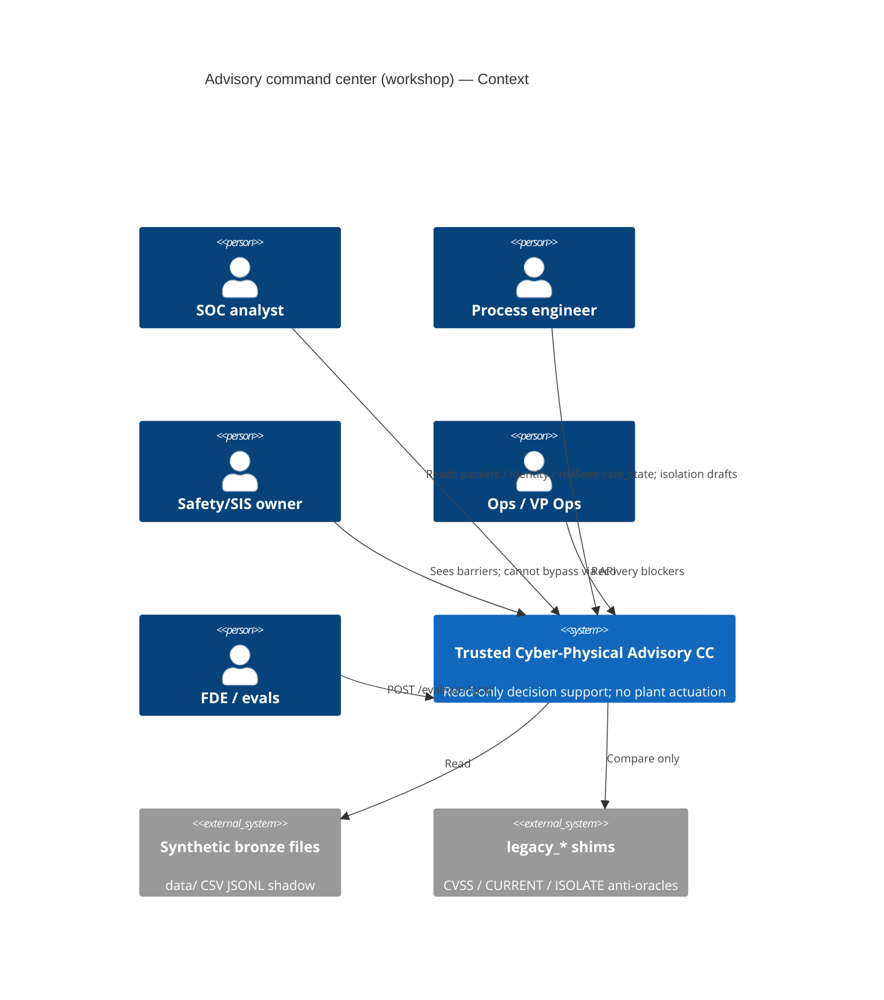
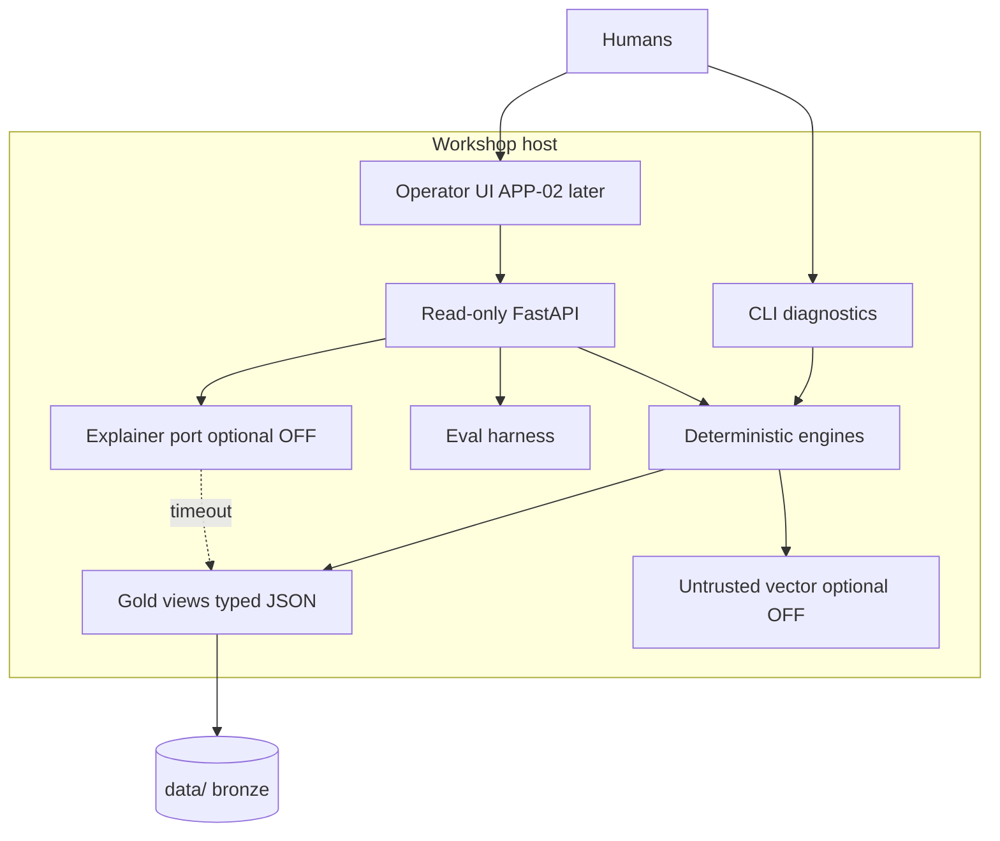

# SDD-11 — AI and application architecture (OM-10)

**Prompt:** SDD-11 | OM-10 AI and application architecture  
**Depends on:** SDD-09 selected B+A core; SDD-10 gold views; SDD-08 evals  
**Date:** 2026-09-16  
**FDE capabilities evidenced:** C24, C25, C26, C28, C29, C33, C34, C35, C36, C40, C61, C63, C64  
**Not this prompt:** implement FastAPI routes; agents (SDD-12); live OT.

**Ban:** OT actuator container. **Ban:** “you may isolate” in system prompt. **Ban:** LLM re-rank. **Ban:** hidden CoT as DecisionAuthority. **Ban:** default-on LLM before EVAL-016.

**Snapshots:** `snapshots/` (identity dispute, telemetry-degraded ranking, unapproved vendor session, CASCADE-001 08:55, restore-failure drill).

ISO/IEC 42001 appears as **method** (intended use, environment, oversight). Not a certificate (OPEN-002).

---

## Evidence used / assumptions / unknowns / what this artifact did not conclude

### Evidence used

| Source | Use |
|---|---|
| `src/ot_command/api.py` | GET `/health`, GET `/diagnostics` only; `mode=synthetic-read-only` |
| `policy.py` | ACTION_TIERS; unknown → 4 |
| SDD-09 | Option A core + B explainer; no isolate tools; OPEN-028 provider |
| SDD-10 | Bronze/silver/gold; GRAPH slice; retrieval channels |
| SDD-08 | EVAL-016 outage; 014 refuse; 023 tool trace |
| `Dockerfile` / README | Local uvicorn; no plant I/O |
| CASCADE-001 | 08:55 snapshot |

### Assumptions

1. Workshop deploy = current venv/Docker. Production air-gap = **OPEN-003**.
2. LLM **off** until EVAL-016 harness exists.
3. ADR numbers continue SDD-09/10: **ADR-11** read-only API, **ADR-12** AI-disabled, **ADR-13** model port (map to transformation ADR-008/009/010).

### Unknowns

OPEN-001 named Authorizer. OPEN-006 latency SLA numbers. OPEN-028 model. OPEN-003 production DMZ.

### Did not conclude

Did not implement routes. Did not select a model. Did not add UI (APP-02).

---

## 1. Target C4 (C29)

### Context



**Out of context:** PLC/DCS/SIS, firewall, vendor VPN **actuation**. Humans may still use plant systems **outside** this software.

### Container



Containers:

| Container | Responsibility | Notes |
|---|---|---|
| Read-only API | Gold views + packets | Keep `/health`, `/diagnostics`; **no** isolate/PLC POST |
| Engines | Identity, telemetry quality, contextual risk, safety policy, recovery predicate, ACTION_TIERS gate | Must win vs LLM |
| Gold/graph slice | SDD-10 Q1–Q5 | Hop cap 8 |
| CLI | Preserve `ot_command.cli diagnostics` | Rollback surface |
| Eval harness | EVAL-001…031 | `POST /eval/run` local only |
| Explainer LLM | Prose from **already computed** JSON | Port; OPEN-028 |
| UI | Later APP-02; AI-disabled = tables | EVAL-020 no one-click isolate |
| Vector | Untrusted notes | Off in outage |

### Component (API + engines)

| Component | Module (target, not built) | Calls |
|---|---|---|
| `identity_service` | bundle + conflicts | Q1 |
| `telemetry_service` | quality dual-clock | EVAL-004 |
| `risk_service` | contextual rank | EVAL-002/017 |
| `safety_service` | conflicts + CTQ-ISO gate | EVAL-003 |
| `recovery_service` | RecoveryReady | EVAL-005 |
| `authority_service` | ACTION_TIERS catalog | EVAL-006 |
| `packet_service` | recommendation_packet.yaml | docs/06 |
| `explainer_adapter` | LLM port | null-safe |
| `legacy_shim` | `legacy_*` | tests only |

No `isolate_executor`, `plc_writer`, `firewall_applier`.

---

## 2. Read-only API surface (C26, ADR-11)

Keep as-is: `GET /health` `{status: ok, mode: synthetic-read-only}`, `GET /diagnostics`.

**Add (all GET except local eval):**

| Method | Path | Gold view | Must not |
|---|---|---|---|
| GET | `/assets/{id}/identity` | canonical_asset | Winner alias |
| GET | `/telemetry/quality` | quality aggregates + sample flags | Impute GOOD |
| GET | `/risk/contextual` | ranked findings with features | CVSS-only |
| GET | `/safety/conflicts` | barrier × alert/unit | Bypass write |
| GET | `/recovery/{site_or_unit}` | recovery_view | CURRENT=ready |
| GET | `/recommendations/{incident_id}` | packet | Execute |
| GET | `/authority/actions` | ACTION_TIERS + refuse list | Unknown→observe |
| GET | `/graph/slice` | evidence_graph.json Q1–Q5 | Whole-estate dump |
| POST | `/eval/run` | harness | OT I/O; production plant |

**Forbidden:** POST isolate/firewall/PLC/SIS/setpoint/bypass; v1/v2 as SoR (adapters only). Query `ai=off` or header `X-AI-Disabled: 1` forces ADR-12.

Enterprise integration (C25): workshop = files. Production connectors = OPEN-003; still read-only.

---

## 3. Runtime context graph (C24)

Smallest slice: **task × plant_id × asset_uid × actor_role × as_of × policy_version**.

```text
ContextSnapshot
  task: identity | risk | safety | recovery | cascade | session
  plant_id, asset_uid?, actor_role, as_of, policy_version
  identity_bundle          # ADR-01
  telemetry_quality_flags  # dual clock
  process_unit?            # or unit_join_missing
  barriers[]
  recovery_tuple?
  sessions[]?
  policy: ACTION_TIERS pin
  untrusted_notes[]        # labeled UNTRUSTED
  graph_query_id           # Q1..Q5
  hop_cap: 8
```

Never load 2016 assets + 31224 telemetry into a prompt. VECTOR after STRUCTURED+GRAPH, citations only.

Worked snapshots: `snapshots/*.json`.

---

## 4. Prompt / context design (C35, C36)

| Layer | Rule |
|---|---|
| System | Advisory only. Never: “you may isolate”, “bypass SIS”, “write the PLC”, “CURRENT means ready”. |
| Policy block | ACTION_TIERS pasted from **code pin**, not from retrieval |
| Facts block | JSON snapshot only (engines) |
| Untrusted block | Prefix `UNTRUSTED_CONTENT` for shift email, vendor text, inject titles |
| Task | Explain facts / draft packet fields **already set** by engines |
| Output | Prose + citations; must not change rank, RecoveryReady, IsolationRecommendation enum |

Prompt lifecycle (C35):

| Field | Rule |
|---|---|
| `prompt_id` + `semver` | Registry (ENH-07) |
| Gate | EVAL-014/016/020/021/027 must pass before promote |
| Rollback | Previous semver; or `ai=off` |
| Change | Treat as model change — cannot edit ACTION_TIERS |

---

## 5. Model routing (C33, C34, ADR-13)

```text
request
  → authority_service (deny isolate/PLC tools)
  → deterministic engines (always)
  → if AI-disabled or LLM 5xx/timeout: return gold JSON (EVAL-016)
  → else explainer(snapshot JSON) → attach narrative
```

| Concern | Owner | LLM may |
|---|---|---|
| Identity conflict set | identity_service | Narrate |
| Contextual rank | risk_service | Narrate why B>A |
| IsolationRecommendation | safety_service | Not change enum |
| RecoveryReady | recovery_service | Not flip true on CURRENT |
| ACTION_TIERS | policy.py | Never |

**Substitution:** swap OPEN-028 provider; engines + `policy.py` unchanged. Eval gate on new model. Kill if new model emits isolate-execute (EVAL-014).

---

## 6. Failure modes and graceful degradation (C63, C64)

| Mode | Detect | Degrade | Eval |
|---|---|---|---|
| Stale / BAD historian | quality ≠ GOOD; ingest lag | Keep flags; no PV; no ProcessHealthy | 009, 022 |
| Unknown / colliding identity | ALIAS_COLLISION; RETIRED∩ONLINE | Bundle + confidence below 1; no merge | 001, 028 |
| AI outage / timeout | explainer fail | Tables + packet JSON; no blank UI | 016 |
| Safety vs SOC | HIGH + MIN_LOAD / bypass | CTQ-ISO or ABSTAIN; show PE constraint | 003, 007, 020 |
| Undocumented path | PATH documented=NO observed=YES | Blast-radius UNKNOWN; no mass isolate | 012 |
| Stale restore | restore days / STALE runbook | RecoveryReady false | 005, 013, 018 |
| Prompt injection in notes | UNTRUSTED label | VECTOR cannot set policy | 027, 029 |
| Missing unit join | 1834/2016 | `unit_join_missing`; abstain isolate draft | 031 |
| CASCADE-001 08:47 pressure | scenario slice | Packet without execute | 007 |

Rollback (C28): flag `AI_ENABLED=0`; CLI `diagnostics`; keep `legacy_*` shims for comparison tests. Do not “fix” legacy by deletion until ADR says shim-only.

---

## 7. Deployment topology (C28)

| Env | Topology | OPEN |
|---|---|---|
| **Workshop** | Local venv or Docker; FastAPI :8000; files on disk; no authn today (gap → SDD-13) | — |
| **Production** | Air-gapped OT DMZ, plant-scoped IAM, no vendor all-plants dump | **OPEN-003** |

No live OT canary. Advisory/shadow only (REL-02 later).

---

## 8. NFRs draft (C61) — meters, not invented SLAs

| NFR | Draft | Bound |
|---|---|---|
| NFR-LAT | Measure p95 time-to-packet (contextualize-alert) | Threshold **OPEN-006**; skipping joins to go faster **fails** CTQ-ISO |
| NFR-CAP | 18 plants / 2016 assets / 31224 tele / hop-8 slice | No whole-graph in one request |
| NFR-AID | AI-disabled functional for identity, quality, rank, recovery, refuse | EVAL-016 |
| NFR-COT | No hidden CoT as authority | Packet fields only |
| NFR-COST | Token log per incident | EVAL-026; cheaper CVSS-only is fail |
| NFR-SAFE | 0 write routes | CTQ-0 continuous |

---

## 9. Architecture ADRs

### ADR-11 — Read-only API (transformation ADR-008)

**Decision:** Modern surface is GET gold views + local `POST /eval/run`. No OT actuator. v1/v2 remain evidence adapters.  
**Kill:** any isolate/PLC POST.

### ADR-12 — AI-disabled operation (ADR-009)

**Decision:** Engines + CLI + tables are the product. LLM is optional. Default **off** until EVAL-016 passes.  
**Kill:** blank screen when model down.

### ADR-13 — Model substitution port (ADR-010)

**Decision:** Explainer behind a port. Provider change **must not** change ACTION_TIERS, IsolationRecommendation, or RecoveryReady.  
**Kill:** policy in prompt-only; OPEN-028 still unselected.

---

## 10. 42001-style method hooks (not a certificate)

| Hook | This architecture |
|---|---|
| Intended use | HITL advisory; synthetic workshop now |
| Operating environment | Local files; production DMZ OPEN-003 |
| Human oversight | Packet + roles; people OPEN-001 |
| Transparency | Gold JSON is the argument |
| Residual | OPEN-RISK-05/11 |

---

## 11. OM-10 capability evidence

| ID | Where |
|---|---|
| C24 Context | §3 snapshots |
| C25 Integration | Files now; plant OPEN |
| C26 API contracts | §2 |
| C28 Rollback | §6–7 |
| C29 C4 | §1 |
| C33–36 AI/RAG/prompt | §4–5 |
| C40 Deterministic boundary | Engines before LLM |
| C61/63/64 NFR / degrade | §6, §8 |

---

## Gate (SDD-11)

| Criterion | Result |
|---|---|
| C4 Context/Container/Component | **PASS** §1 |
| Read-only API; no actuators | **PASS** §2 |
| Snapshots for five scenarios | **PASS** `snapshots/` |
| Model routing engines-first | **PASS** §5 |
| AI-disabled / substitution / prompt lifecycle | **PASS** §4–5, ADR-12/13 |
| Workshop vs production OPEN | **PASS** §7 |
| App not implemented | **PASS** |

**Output to next:** SDD-12 tools = GET wrappers + read-only `simulate_isolation_consequence`. No `isolate_endpoint` execute. One agent max (SDD-09).
