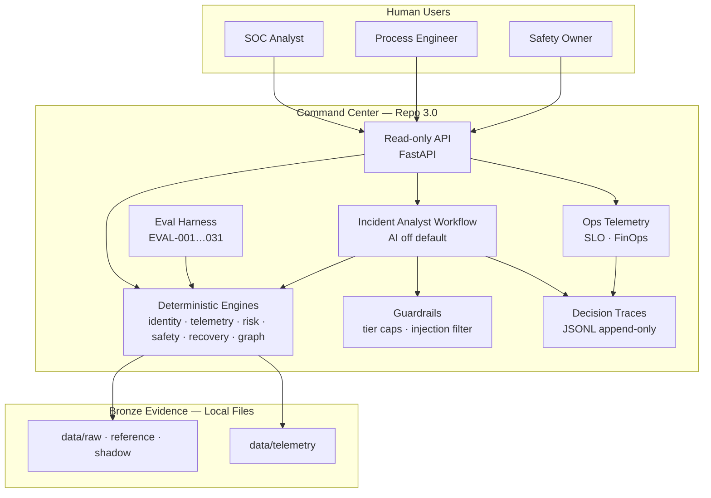

# As-Built C4 — Repo 3.0 (Synthetic Advisory)

**Date:** 2026-09-16  
**Status:** As-built for workshop increment — not production deployment diagram.

## Context

Operators and SOC analysts triage ICS/OT incidents on a **multinational brownfield estate** with intentional inventory, telemetry, safety, and recovery contradictions. External actors: vendor remote access, enterprise SIEM (observed via alerts CSV), CMMS/work orders — all **synthetic files**, no live connectors.

## Container diagram

## Components

| Container | Path | Responsibility |
|-----------|------|----------------|
| API | `src/ot_command/api.py` | Gold GETs, `POST /recommend`, `POST /eval/run`, ops endpoints |
| Identity engine | `core/identity.py` | FR-001 bundles, conflicts |
| Telemetry engine | `core/telemetry.py` | FR-002 dual clock, quality |
| Risk engine | `core/risk.py` | FR-003 contextual rank |
| Safety engine | `core/containment.py` | FR-004 isolation assessment |
| Recovery engine | `core/recovery.py` | FR-005 RecoveryReady |
| Graph slice | `core/graph_slice.py` | FR-006 Q1–Q5, hop cap 8 |
| Agent | `core/agent.py` | FR-012 workflow, 8 states |
| Guardrails | `core/guardrails.py` | NFR-SAFE, red team |
| Traces | `core/traces.py` | FR-008 audit JSONL |
| Ops | `core/ops.py` | SLO + cost synthesis |
| Legacy shim | `legacy/*.py` | As-is baseline (XFAIL contrast) |

## Deployment (local / container)

- **Dockerfile** — Python 3.11 slim, `uvicorn` on port 8000
- **Makefile** — `make ci` = gates + verify + test + eval + red-team
- **No actuator container** — ADR-11

## Key boundaries

- Engines read bronze CSV/JSONL only
- No PLC/SIS/firewall write APIs
- Optional LLM explainer port not enabled (ADR-12/13)
- Vector/untrusted notes cited, never authoritative for isolation

## Related ADRs

ADR-01 identity · ADR-04 safety · ADR-05 recovery · ADR-07 agent · ADR-09 JSON graph · ADR-11 read-only API · ADR-12 AI-disabled core
